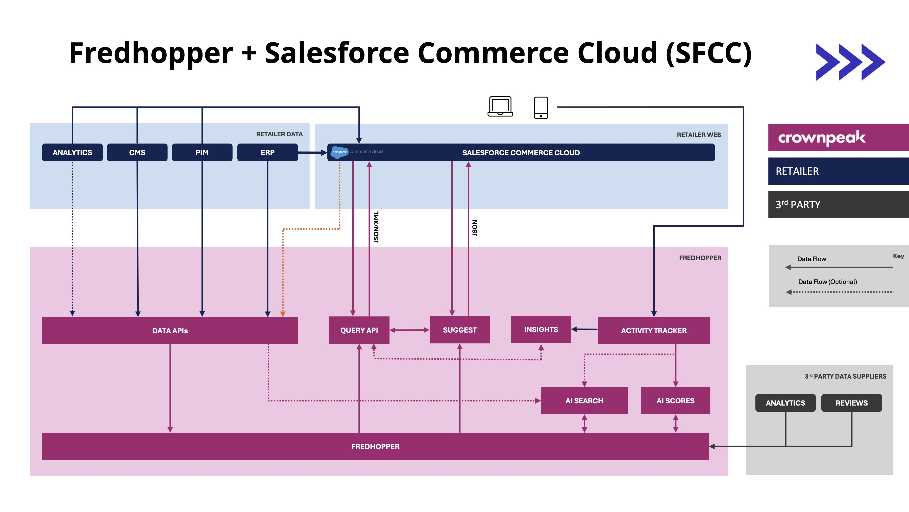

---
layout:
  title:
    visible: false
  description:
    visible: false
  tableOfContents:
    visible: true
  outline:
    visible: true
  pagination:
    visible: true
---

# Architectural Principles

[**Salesforce Commerce Cloud Reference Architecture**](../../)

## Architectural Principles

This section outlines the fundamental architectural principles for integrating Fredhopper with Salesforce Commerce Cloud (SFCC). A well-defined architecture is crucial for ensuring a scalable, performant, and maintainable integration. We'll explore the high-level system overview, key component interactions, and essential considerations for security and performance.

Understanding these principles will provide a solid foundation for the subsequent sections, where we delve into the specifics of data ingestion and storefront integration. By adhering to these guidelines, you can build a robust and efficient solution that leverages the strengths of both Fredhopper and SFCC.

### High-Level Architecture Overview

The following diagram shows a high-level typical architecture deployment of Fredhopper & SFCC. While each customer's implementation will vary, this can be used as a general starting point for implementation discussion.

#### Key Components and Interactions

The following is a description of each component shown on the High-Level Architecture Diagram (above).

| Component                     | Description                                                                                                                                                                                                                                                                                                                                        |
| ----------------------------- | -------------------------------------------------------------------------------------------------------------------------------------------------------------------------------------------------------------------------------------------------------------------------------------------------------------------------------------------------- |
| **Data APIs**                 | The pipeline for providing Fredhopper with product updates, in batch or incremental forms. Data is sent to these APIs to keep product data current within Fredhopper. This can be achieved by using the Items API for full API based integrations, or by using the Services API for file based integration.                                        |
| **Query API**                 | The API for interacting with Fredhopper for product or navigation queries to power the frontend storefront, returning XML or JSON.                                                                                                                                                                                                                 |
| **Suggest**                   | The API for retrieving search suggestions, returning JSON.                                                                                                                                                                                                                                                                                         |
| **Insights**                  | Customer usage data reporting.                                                                                                                                                                                                                                                                                                                     |
| **Activity Tracker**          | Client-side activity tracker. Customer interaction is notified here to effect data returned by Fredhopper.                                                                                                                                                                                                                                         |
| **AI Search**                 | Multi-pass search interprets user intent, activity, and traits to go beyond keywords by recognizing meaning and context in both text and images.                                                                                                                                                                                                   |
| **AI Scores**                 | AI Scores turns signals into smart, real-time actions by tracking behaviour across the entire journey to identify patterns and build meaningful segments.                                                                                                                                                                                          |
| **Salesforce Commerce Cloud** | Salesforce Commerce Cloud (SFCC) is a cloud-based platform that helps businesses sell products and services online. In this diagram, SFCC drives all sales channels within the Retailer Web. Optionally, data can be sent directly from SFCC to the Data APIs, as opposed to or in addition to, coming from the Retailer Data back-office systems. |
| **Retailer Data**             | Core portions of the customer experience architecture that drive e-commerce back-office functions. The systems involved will vary by customer.                                                                                                                                                                                                     |
| **3rd Party Data Suppliers**  | Any relevant 3rd party data, such as Google Analytics, that may be integrated to impact the responses from Fredhopper.                                                                                                                                                                                                                             |

### Scalability and Performance Considerations

When integrating Fredhopper with Salesforce Commerce Cloud (SFCC), scalability and performance are paramount to ensure a seamless customer experience, especially during peak traffic periods. Here's a breakdown of critical considerations:

#### Data Ingestion Optimization

* **Incremental Updates:** Use incremental updates to send individual product changes throughout the day to work with the most current product data.
* **Batch Processing:** Use batch processing for full data ingestion once a day to send all product data to minimize the impact on system resources.
* **Efficient Data Transformation:** Optimize data transformation scripts for performance. Avoid unnecessary data manipulations and use efficient algorithms. Only include product data that is useful/required for the Fredhopper merchandising use cases.
* **API Throttling and Rate Limiting:** Understand and respect API rate limits from SFCC. Implement retry mechanisms with exponential backoff to handle temporary API issues.

#### Query Performance

* **Caching:** Implement robust caching strategies at various levels (e.g., CDN, application server, client-side).
* **Query Optimization:** Optimize Fredhopper query configurations for performance. Utilize single queries per page, reduce display fields and filters to minimize query execution time. Use suppression parameters to suppress not needed elements and functions.
* **Asynchronous Queries:** For complex queries or heavy traffic, consider using asynchronous query processing to prevent blocking the main application thread.
* **Load Balancing:** Distribute Fredhopper query load across multiple IPs or instances to prevent overload and ensure high availability.
* **Proper Indexing:** Ensure your Fredhopper indexes are properly configured. Index only the necessary attributes.

#### Infrastructure and Resource Management

* **Scalable Infrastructure:** Design your infrastructure to scale horizontally to handle increasing traffic and data volume.
* **Resource Monitoring:** Implement comprehensive monitoring of system resources (CPU, memory, network) to identify bottlenecks and performance issues.
* **CDN Usage:** Utilize a Content Delivery Network (CDN) to cache static assets and reduce latency for storefront requests.

#### Code Optimization

* **Efficient Code:** Write efficient code for storefront integration and data processing. Minimize unnecessary network requests and data transfers.
* **Profiling and Performance Testing:** Regularly profile your code and conduct performance testing to identify and address performance bottlenecks.
* **Minimize Payload Size:** Reduce the size of data payloads transferred between SFCC, Fredhopper, and the storefront.

#### Fredhopper Specific Considerations

* **Relevance Tuning:** Fine-tune search index configuration and ranking cocktails within Fredhopper to ensure accurate and relevant search results.
* **Facet Optimization:** Optimize facet configurations to ensure effective queries and navigation, and removal of redundant facets.

\
By carefully considering these scalability and performance aspects, you can build a robust and efficient Fredhopper and SFCC integration that delivers a superior customer experience.

### Security Best Practices

Security is a critical consideration when integrating Fredhopper with Salesforce Commerce Cloud (SFCC). Protecting sensitive data and ensuring secure communication is essential for maintaining customer trust and preventing security breaches. Here's a breakdown of key security best practices:

#### API Security

* **Authentication and Authorization:**
  * Implement role-based access control (RBAC) to restrict API access to authorized users and applications.
  * Avoid embedding API keys or user credentials directly in client-side code.
* **HTTPS Encryption:**
  * Ensure all API communication between SFCC, Fredhopper, and the storefront is conducted over HTTPS to encrypt data in transit.
* **API Rate Limiting:**
  * Implement API rate limiting to prevent abuse and denial-of-service (DoS) attacks.
  * Sanitize all API inputs and outputs to prevent injection attacks.

#### Data Security

* **Data Minimization:**
  * Only transfer and store the data necessary for search and navigation functionality.
  * Avoid storing sensitive personal information (SPI).
* **Regular Security Audits:**
  * Conduct regular security audits and penetration testing to identify and address vulnerabilities.
* **Data Masking:**
  * Mask sensitive data inside of logs, or during development and testing.

#### Storefront Security

* **Cross-Site Scripting (XSS) Protection:**
  * Sanitize all user inputs and outputs to prevent XSS attacks.
* **Cross-Site Request Forgery (CSRF) Protection:**
  * Implement CSRF protection mechanisms to prevent unauthorized requests.
* **Content Security Policy (CSP):**
  * Use CSP to restrict the resources that the browser can load, mitigating the risk of XSS and other attacks.
* **Secure Cookies:**
  * Use secure and HTTP-only cookies to protect session information.
* **Regular Security Updates:**
  * Keep all software components up to date with the latest security patches.

#### SFCC Specific Security

* **OCAPI Security:**
  * Follow Salesforce best practices for OCAPI security.
* **SFCC Roles and Permissions:**
  * Utilize SFCC roles and permissions to restrict access to sensitive data and functionality.

\
By implementing these security best practices, you can create a secure and reliable Fredhopper and SFCC integration that protects sensitive data and maintains customer trust.
