# Architecture

This document provides a deep technical overview of the Fredhopper Shopify App's architecture. Every diagram is derived directly from the source code and reflects exact action names, queue configurations, timeouts, and data flows.

---

## 1. System Context

The app sits between three systems: **Shopify** (source of truth for product data), the **Gadget platform** (runtime environment), and **Fredhopper** (search & merchandising engine). All data flows are queue-based.

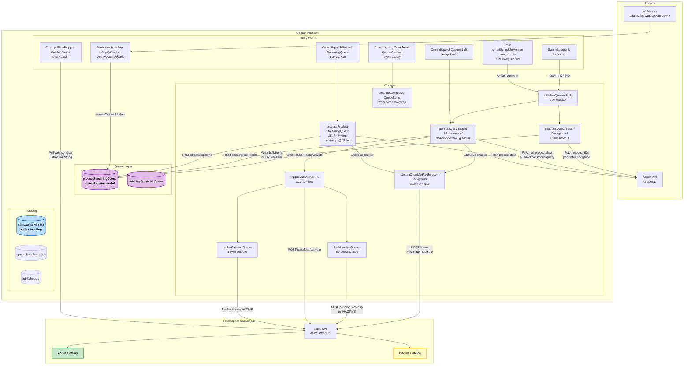
```mermaid
graph TB
    subgraph "Shopify"
        S_ADMIN["Admin API<br/><i>GraphQL</i>"]
        S_HOOKS["Webhooks<br/><i>products/create,update,delete</i>"]
    end

    subgraph "Gadget Platform"
        direction TB
        subgraph "Entry Points"
            UI["Sync Manager UI<br/><i>/bulk-sync</i>"]
            CRON_S["Cron: dispatchProduct-<br/>StreamingQueue<br/><i>every 1 min</i>"]
            CRON_B["Cron: dispatchQueuedBulk<br/><i>every 1 min</i>"]
            CRON_M["Cron: smartScheduleMonitor<br/><i>every 1 min<br/>acts every 10 min</i>"]
            CRON_P["Cron: pollFredhopper-<br/>CatalogStatus<br/><i>every 1 min</i>"]
            CRON_C["Cron: dispatchCompleted-<br/>QueueCleanup<br/><i>every 1 hour</i>"]
            WH_HANDLER["Webhook Handlers<br/><i>shopifyProduct<br/>create/update/delete</i>"]
        end

        subgraph "Queue Layer"
            PSQ[("productStreamingQueue<br/><b>shared queue model</b>")]
            CSQ[("categoryStreamingQueue")]
        end

        subgraph "Workers"
            INIT["initializeQueuedBulk<br/><i>60s timeout</i>"]
            POP["populateQueuedBulk-<br/>Background<br/><i>15min timeout</i>"]
            PROC_B["processQueuedBulk<br/><i>15min timeout<br/>self-re-enqueue @10min</i>"]
            PROC_S["processProduct-<br/>StreamingQueue<br/><i>15min timeout<br/>poll loop @10min</i>"]
            STREAM["streamChunkToFredhopper-<br/>Background<br/><i>15min timeout</i>"]
            ACT["triggerBulkActivation<br/><i>3min timeout</i>"]
            FLUSH["flushInactiveQueue-<br/>BeforeActivation"]
            REPLAY["replayCatchupQueue<br/><i>15min timeout</i>"]
            CLEANUP["cleanupCompleted-<br/>QueueItems<br/><i>9min processing cap</i>"]
        end

        subgraph "Tracking"
            BQP[("bulkQueueProcess<br/><b>status tracking</b>")]
            QSS[("queueStatsSnapshot")]
            JS[("jobSchedule")]
        end
    end

    subgraph "Fredhopper Crownpeak"
        FH_ITEMS["Items API<br/><i>items.attraqt.io</i>"]
        FH_CAT_A["Active Catalog"]
        FH_CAT_I["Inactive Catalog"]
    end

    S_HOOKS --> WH_HANDLER
    WH_HANDLER -->|"streamProductUpdate"| PSQ
    UI -->|"Start Bulk Sync"| INIT
    CRON_M -->|"Smart Schedule"| INIT
    INIT --> POP
    INIT --> PROC_B
    POP -->|"Fetch product IDs<br/>paginated 250/page"| S_ADMIN
    POP -->|"Write bulk items<br/>isBulkItem=true"| PSQ
    PROC_B -->|"Read pending bulk items"| PSQ
    PROC_B -->|"Fetch full product data<br/>40/batch via nodes query"| S_ADMIN
    PROC_B -->|"Enqueue chunks"| STREAM
    STREAM -->|"POST /items<br/>POST /items/delete"| FH_ITEMS
    FH_ITEMS --> FH_CAT_I
    PROC_B -->|"When done + autoActivate"| ACT
    ACT --> FLUSH
    FLUSH -->|"Flush pending_catchup<br/>to INACTIVE"| FH_ITEMS
    ACT -->|"POST /catalogs/activate"| FH_ITEMS
    ACT --> REPLAY
    REPLAY -->|"Replay to now-ACTIVE"| FH_ITEMS
    FH_ITEMS --> FH_CAT_A
    CRON_S --> PROC_S
    PROC_S -->|"Read streaming items"| PSQ
    PROC_S -->|"Fetch product data"| S_ADMIN
    PROC_S -->|"Enqueue chunks"| STREAM
    CRON_B --> PROC_B
    CRON_P -->|"Poll catalog state<br/>+ stale watchdog"| FH_ITEMS
    CRON_C --> CLEANUP

    style PSQ fill:#e1bee7,stroke:#7b1fa2,stroke-width:2px,color:#000
    style CSQ fill:#e1bee7,stroke:#7b1fa2,stroke-width:2px,color:#000
    style BQP fill:#bbdefb,stroke:#1565c0,stroke-width:2px,color:#000
    style FH_CAT_A fill:#c8e6c9,stroke:#2e7d32,stroke-width:2px,color:#000
    style FH_CAT_I fill:#fff9c4,stroke:#f9a825,stroke-width:2px,color:#000
```

---

## 2. Bulk Sync — Complete Flow

A bulk sync rebuilds the entire Fredhopper catalog. The process runs across multiple chained actions, each with its own timeout and queue constraints.

### 2.1 Initialization

`initializeQueuedBulk` (60s timeout) orchestrates setup and enqueues the two background workers.

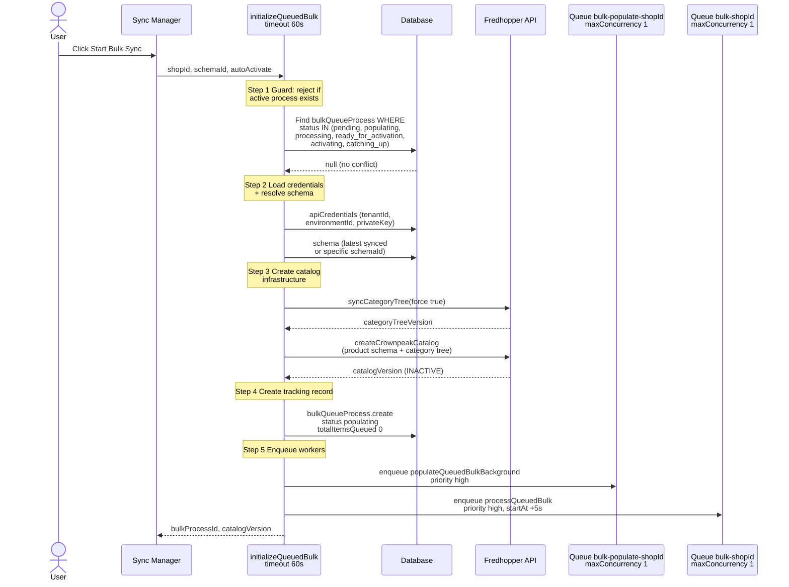
```mermaid
sequenceDiagram
    actor User
    participant UI as Sync Manager
    participant INIT as initializeQueuedBulk<br/>timeout 60s
    participant DB as Database
    participant FH as Fredhopper API
    participant Q_POP as Queue bulk-populate-shopId<br/>maxConcurrency 1
    participant Q_BULK as Queue bulk-shopId<br/>maxConcurrency 1

    User ->> UI: Click Start Bulk Sync
    UI ->> INIT: shopId, schemaId, autoActivate

    Note over INIT: Step 1 Guard: reject if<br/>active process exists

    INIT ->> DB: Find bulkQueueProcess WHERE<br/>status IN (pending, populating,<br/>processing, ready_for_activation,<br/>activating, catching_up)
    DB -->> INIT: null (no conflict)

    Note over INIT: Step 2 Load credentials<br/>+ resolve schema

    INIT ->> DB: apiCredentials (tenantId,<br/>environmentId, privateKey)
    INIT ->> DB: schema (latest synced<br/>or specific schemaId)

    Note over INIT: Step 3 Create catalog<br/>infrastructure

    INIT ->> FH: syncCategoryTree(force true)
    FH -->> INIT: categoryTreeVersion
    INIT ->> FH: createCrownpeakCatalog<br/>(product schema + category tree)
    FH -->> INIT: catalogVersion (INACTIVE)

    Note over INIT: Step 4 Create tracking record

    INIT ->> DB: bulkQueueProcess.create<br/>status populating<br/>totalItemsQueued 0

    Note over INIT: Step 5 Enqueue workers

    INIT ->> Q_POP: enqueue populateQueuedBulkBackground<br/>priority high
    INIT ->> Q_BULK: enqueue processQueuedBulk<br/>priority high, startAt +5s

    INIT -->> UI: bulkProcessId, catalogVersion
```

### 2.2 Queue Population

`populateQueuedBulkBackground` (15min timeout) fetches all product IDs from Shopify and writes them to the queue.

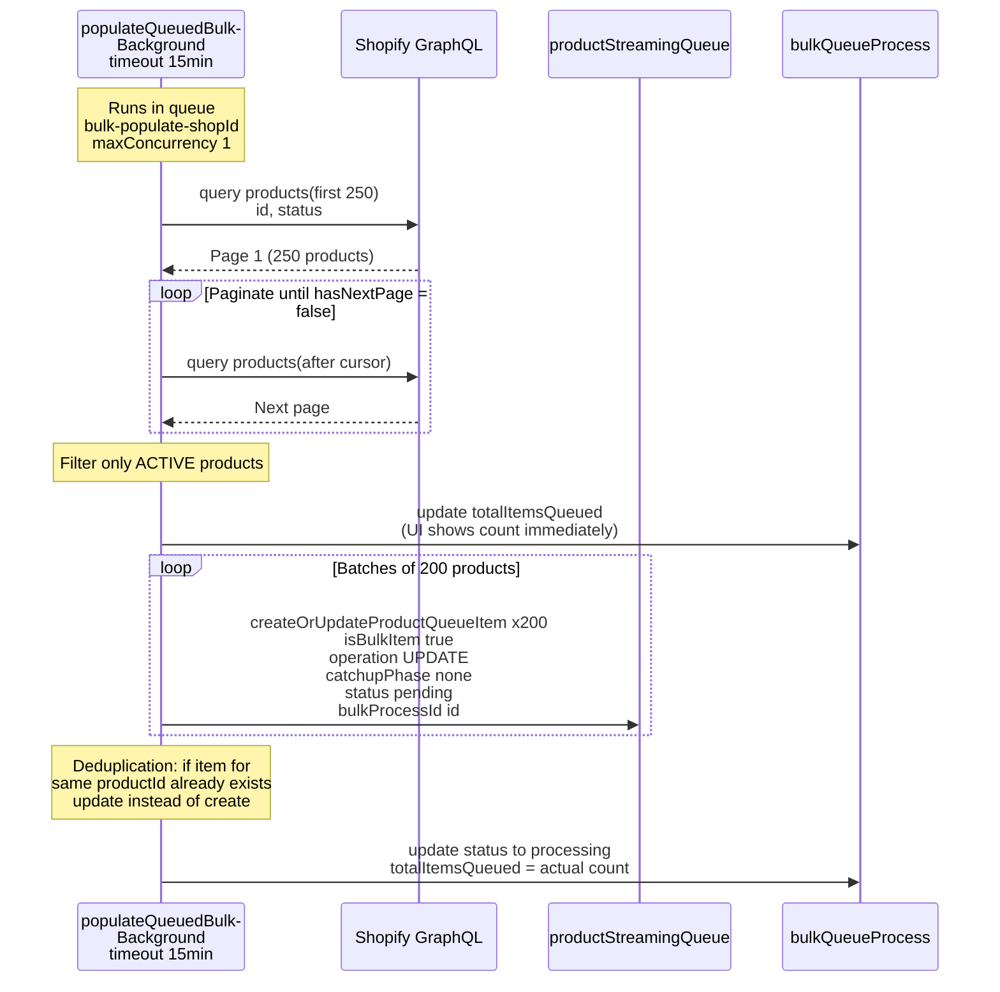
```mermaid
sequenceDiagram
    participant POP as populateQueuedBulk-<br/>Background<br/>timeout 15min
    participant SHOPIFY as Shopify GraphQL
    participant PSQ as productStreamingQueue
    participant BQP as bulkQueueProcess

    Note over POP: Runs in queue<br/>bulk-populate-shopId<br/>maxConcurrency 1

    POP ->> SHOPIFY: query products(first 250)<br/>id, status
    SHOPIFY -->> POP: Page 1 (250 products)

    loop Paginate until hasNextPage = false
        POP ->> SHOPIFY: query products(after cursor)
        SHOPIFY -->> POP: Next page
    end

    Note over POP: Filter only ACTIVE products

    POP ->> BQP: update totalItemsQueued<br/>(UI shows count immediately)

    loop Batches of 200 products
        POP ->> PSQ: createOrUpdateProductQueueItem x200<br/>isBulkItem true<br/>operation UPDATE<br/>catchupPhase none<br/>status pending<br/>bulkProcessId id
    end

    Note over POP: Deduplication: if item for<br/>same productId already exists<br/>update instead of create

    POP ->> BQP: update status to processing<br/>totalItemsQueued = actual count
```

### 2.3 Bulk Processing — The Main Worker

`processQueuedBulk` (15min timeout, 10min self-checkpoint) is the heavyweight processor. It runs in a self-re-enqueueing loop.

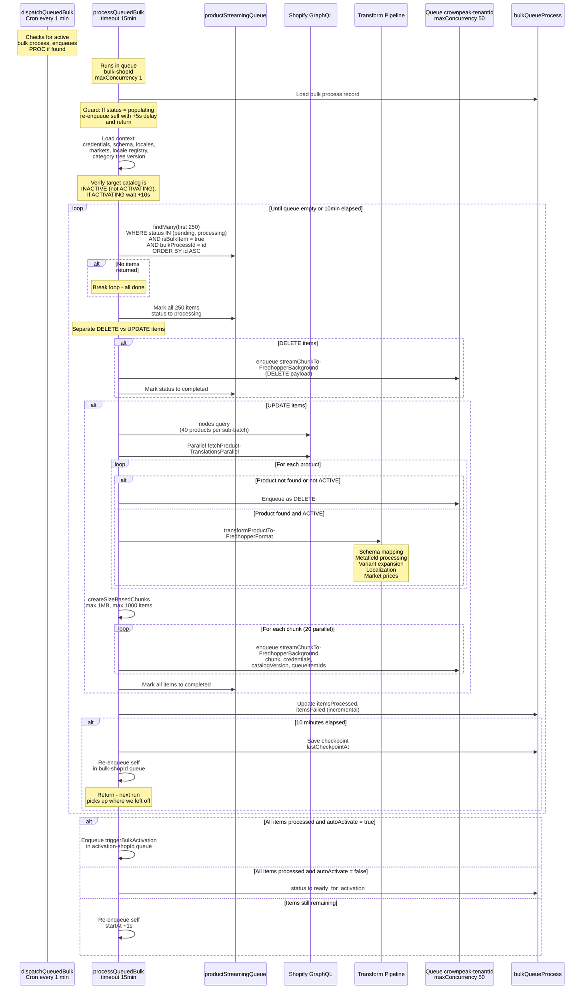
```mermaid
sequenceDiagram
    participant DISP as dispatchQueuedBulk<br/>Cron every 1 min
    participant PROC as processQueuedBulk<br/>timeout 15min
    participant PSQ as productStreamingQueue
    participant SHOPIFY as Shopify GraphQL
    participant TRANSFORM as Transform Pipeline
    participant Q_FH as Queue crownpeak-tenantId<br/>maxConcurrency 50
    participant BQP as bulkQueueProcess

    Note over DISP: Checks for active<br/>bulk process, enqueues<br/>PROC if found

    Note over PROC: Runs in queue<br/>bulk-shopId<br/>maxConcurrency 1

    PROC ->> BQP: Load bulk process record
    Note over PROC: Guard: If status = populating<br/>re-enqueue self with +5s delay<br/>and return

    PROC ->> PROC: Load context:<br/>credentials, schema, locales,<br/>markets, locale registry,<br/>category tree version

    Note over PROC: Verify target catalog is<br/>INACTIVE (not ACTIVATING).<br/>If ACTIVATING wait +10s

    loop Until queue empty or 10min elapsed
        PROC ->> PSQ: findMany(first 250)<br/>WHERE status IN (pending, processing)<br/>AND isBulkItem = true<br/>AND bulkProcessId = id<br/>ORDER BY id ASC

        alt No items returned
            Note over PROC: Break loop - all done
        end

        PROC ->> PSQ: Mark all 250 items<br/>status to processing

        Note over PROC: Separate DELETE vs UPDATE items

        alt DELETE items
            PROC ->> Q_FH: enqueue streamChunkTo-<br/>FredhopperBackground<br/>(DELETE payload)
            PROC ->> PSQ: Mark status to completed
        end

        alt UPDATE items
            PROC ->> SHOPIFY: nodes query<br/>(40 products per sub-batch)
            PROC ->> SHOPIFY: Parallel fetchProduct-<br/>TranslationsParallel

            loop For each product
                alt Product not found or not ACTIVE
                    PROC ->> Q_FH: Enqueue as DELETE
                else Product found and ACTIVE
                    PROC ->> TRANSFORM: transformProductTo-<br/>FredhopperFormat
                    Note over TRANSFORM: Schema mapping<br/>Metafield processing<br/>Variant expansion<br/>Localization<br/>Market prices
                end
            end

            PROC ->> PROC: createSizeBasedChunks<br/>max 1MB, max 1000 items

            loop For each chunk (20 parallel)
                PROC ->> Q_FH: enqueue streamChunkTo-<br/>FredhopperBackground<br/>chunk, credentials,<br/>catalogVersion, queueItemIds
            end

            PROC ->> PSQ: Mark all items to completed
        end

        PROC ->> BQP: Update itemsProcessed,<br/>itemsFailed (incremental)

        alt 10 minutes elapsed
            PROC ->> BQP: Save checkpoint<br/>lastCheckpointAt
            PROC ->> PROC: Re-enqueue self<br/>in bulk-shopId queue
            Note over PROC: Return - next run<br/>picks up where we left off
        end
    end

    alt All items processed and autoActivate = true
        PROC ->> PROC: Enqueue triggerBulkActivation<br/>in activation-shopId queue
    else All items processed and autoActivate = false
        PROC ->> BQP: status to ready_for_activation
    else Items still remaining
        PROC ->> PROC: Re-enqueue self<br/>startAt +1s
    end
```

### 2.4 Self-Re-Enqueueing Pattern

Gadget actions have a hard 15-minute timeout. The processor works for 10 minutes, saves its progress, and re-enqueues itself to continue. Each run is **idempotent** — it picks up pending items regardless of where the last run stopped.

```mermaid
graph LR
    subgraph "Run 1 (0 to 10 min)"
        R1_START["Start<br/>250 items per batch"]
        R1_WORK["Process batches<br/>Items 1 to 2500"]
        R1_CHECK["10min reached?"]
        R1_SAVE["Save checkpoint<br/>itemsProcessed 2500"]
        R1_ENQ["Re-enqueue self<br/>queue bulk-shopId"]
    end

    subgraph "Run 2 (10 to 20 min)"
        R2_START["Start<br/>Read from pending items"]
        R2_WORK["Process batches<br/>Items 2501 to 5000"]
        R2_CHECK["10min reached?"]
        R2_SAVE["Save checkpoint<br/>itemsProcessed 5000"]
        R2_ENQ["Re-enqueue self"]
    end

    subgraph "Run N (final)"
        RN_START["Start"]
        RN_WORK["Process remaining<br/>Items 5001 to 5247"]
        RN_EMPTY["Queue empty"]
        RN_DONE["Enqueue<br/>triggerBulkActivation"]
    end

    R1_START --> R1_WORK --> R1_CHECK -->|Yes| R1_SAVE --> R1_ENQ
    R1_ENQ -.->|"Named queue ensures<br/>sequential execution"| R2_START
    R2_START --> R2_WORK --> R2_CHECK -->|Yes| R2_SAVE --> R2_ENQ
    R2_ENQ -.-> RN_START
    RN_START --> RN_WORK --> RN_EMPTY --> RN_DONE

    style R1_SAVE fill:#fff9c4,stroke:#f9a825,color:#000
    style R2_SAVE fill:#fff9c4,stroke:#f9a825,color:#000
    style RN_DONE fill:#c8e6c9,stroke:#2e7d32,color:#000
```

### 2.5 Chunk Streaming to Fredhopper

`streamChunkToFredhopperBackground` sends transformed product data to the Fredhopper Items API. It runs in a per-tenant queue with high concurrency.

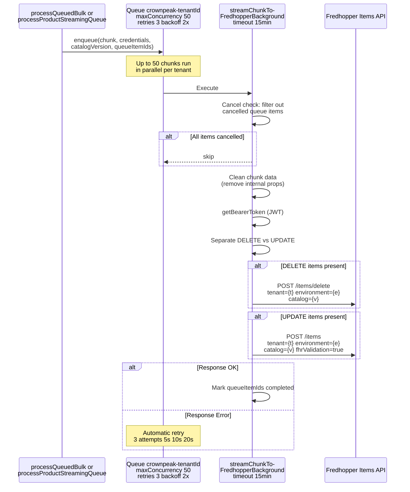
```mermaid
sequenceDiagram
    participant PROC as processQueuedBulk or<br/>processProductStreamingQueue
    participant Q_FH as Queue crownpeak-tenantId<br/>maxConcurrency 50<br/>retries 3 backoff 2x
    participant STREAM as streamChunkTo-<br/>FredhopperBackground<br/>timeout 15min
    participant FH as Fredhopper Items API

    PROC ->> Q_FH: enqueue(chunk, credentials,<br/>catalogVersion, queueItemIds)

    Note over Q_FH: Up to 50 chunks run<br/>in parallel per tenant

    Q_FH ->> STREAM: Execute

    STREAM ->> STREAM: Cancel check: filter out<br/>cancelled queue items

    alt All items cancelled
        STREAM -->> Q_FH: skip
    end

    STREAM ->> STREAM: Clean chunk data<br/>(remove internal props)
    STREAM ->> STREAM: getBearerToken (JWT)

    STREAM ->> STREAM: Separate DELETE vs UPDATE

    alt DELETE items present
        STREAM ->> FH: POST /items/delete<br/>tenant={t} environment={e}<br/>catalog={v}
    end

    alt UPDATE items present
        STREAM ->> FH: POST /items<br/>tenant={t} environment={e}<br/>catalog={v} fhrValidation=true
    end

    alt Response OK
        STREAM ->> STREAM: Mark queueItemIds completed
    else Response Error
        Note over Q_FH: Automatic retry<br/>3 attempts 5s 10s 20s
    end
```

### 2.6 Bulk Sync Status Lifecycle

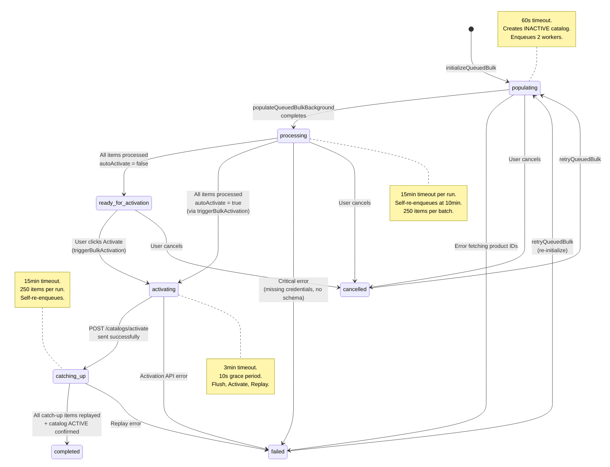
```mermaid
stateDiagram-v2
    [*] --> populating : initializeQueuedBulk

    populating --> processing : populateQueuedBulkBackground<br/>completes
    populating --> failed : Error fetching product IDs
    populating --> cancelled : User cancels

    processing --> ready_for_activation : All items processed<br/>autoActivate = false
    processing --> activating : All items processed<br/>autoActivate = true<br/>(via triggerBulkActivation)
    processing --> failed : Critical error<br/>(missing credentials, no schema)
    processing --> cancelled : User cancels

    ready_for_activation --> activating : User clicks Activate<br/>(triggerBulkActivation)
    ready_for_activation --> cancelled : User cancels

    activating --> catching_up : POST /catalogs/activate<br/>sent successfully
    activating --> failed : Activation API error

    catching_up --> completed : All catch-up items replayed<br/>+ catalog ACTIVE confirmed
    catching_up --> failed : Replay error

    failed --> populating : retryQueuedBulk<br/>(re-initialize)
    cancelled --> populating : retryQueuedBulk

    note left of populating
      60s timeout.
      Creates INACTIVE catalog.
      Enqueues 2 workers.
    end note

    note right of processing
      15min timeout per run.
      Self-re-enqueues at 10min.
      250 items per batch.
    end note

    note right of activating
      3min timeout.
      10s grace period.
      Flush, Activate, Replay.
    end note

    note left of catching_up
      15min timeout.
      250 items per run.
      Self-re-enqueues.
    end note
```

---

## 3. Activation & Catch-Up

When bulk processing completes, the activation sequence ensures zero data loss by handling webhook events that arrived during processing.

### 3.1 Activation Sequence

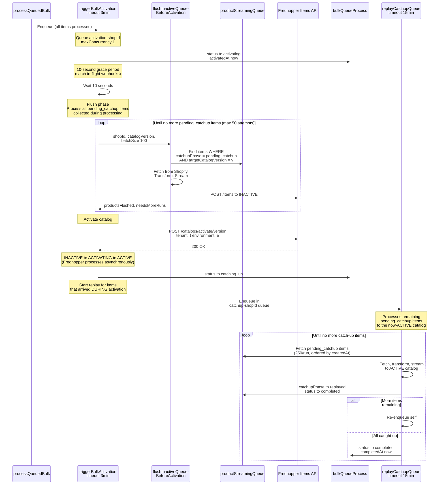
```mermaid
sequenceDiagram
    participant PROC as processQueuedBulk
    participant ACT as triggerBulkActivation<br/>timeout 3min
    participant FLUSH as flushInactiveQueue-<br/>BeforeActivation
    participant PSQ as productStreamingQueue
    participant FH as Fredhopper Items API
    participant BQP as bulkQueueProcess
    participant REPLAY as replayCatchupQueue<br/>timeout 15min

    PROC ->> ACT: Enqueue (all items processed)
    Note over ACT: Queue activation-shopId<br/>maxConcurrency 1

    ACT ->> BQP: status to activating<br/>activatedAt now

    Note over ACT: 10-second grace period<br/>(catch in-flight webhooks)

    ACT ->> ACT: Wait 10 seconds

    Note over ACT: Flush phase<br/>Process all pending_catchup items<br/>collected during processing

    loop Until no more pending_catchup items (max 50 attempts)
        ACT ->> FLUSH: shopId, catalogVersion,<br/>batchSize 100
        FLUSH ->> PSQ: Find items WHERE<br/>catchupPhase = pending_catchup<br/>AND targetCatalogVersion = v
        FLUSH ->> FLUSH: Fetch from Shopify,<br/>Transform, Stream
        FLUSH ->> FH: POST /items to INACTIVE
        FLUSH -->> ACT: productsFlushed, needsMoreRuns
    end

    Note over ACT: Activate catalog

    ACT ->> FH: POST /catalogs/activate/version<br/>tenant=t environment=e
    FH -->> ACT: 200 OK

    Note over ACT: INACTIVE to ACTIVATING to ACTIVE<br/>(Fredhopper processes asynchronously)

    ACT ->> BQP: status to catching_up

    Note over ACT: Start replay for items<br/>that arrived DURING activation

    ACT ->> REPLAY: Enqueue in<br/>catchup-shopId queue

    Note over REPLAY: Processes remaining<br/>pending_catchup items<br/>to the now-ACTIVE catalog

    loop Until no more catch-up items
        REPLAY ->> PSQ: Fetch pending_catchup items<br/>(250/run, ordered by createdAt)
        REPLAY ->> REPLAY: Fetch, transform, stream<br/>to ACTIVE catalog
        REPLAY ->> PSQ: catchupPhase to replayed<br/>status to completed

        alt More items remaining
            REPLAY ->> REPLAY: Re-enqueue self
        else All caught up
            REPLAY ->> BQP: status to completed<br/>completedAt now
        end
    end
```

### 3.2 Dual-Write Strategy (Catch-Up Mechanism)

During bulk processing, every webhook event creates **two** queue entries to ensure zero data loss.

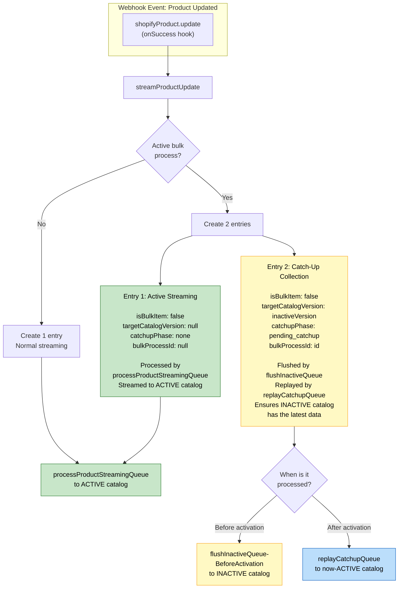
```mermaid
graph TB
    subgraph "Webhook Event: Product Updated"
        WH["shopifyProduct.update<br/>(onSuccess hook)"]
    end

    WH --> SPU["streamProductUpdate"]

    SPU --> CHECK{"Active bulk<br/>process?"}

    CHECK -->|"No"| ENTRY_1_ONLY["Create 1 entry<br/>Normal streaming"]
    CHECK -->|"Yes"| DUAL["Create 2 entries"]

    DUAL --> ENTRY_1["Entry 1: Active Streaming<br/><br/>isBulkItem: false<br/>targetCatalogVersion: null<br/>catchupPhase: none<br/>bulkProcessId: null<br/><br/>Processed by<br/>processProductStreamingQueue<br/>Streamed to ACTIVE catalog"]

    DUAL --> ENTRY_2["Entry 2: Catch-Up Collection<br/><br/>isBulkItem: false<br/>targetCatalogVersion: inactiveVersion<br/>catchupPhase: pending_catchup<br/>bulkProcessId: id<br/><br/>Flushed by flushInactiveQueue<br/>Replayed by replayCatchupQueue<br/>Ensures INACTIVE catalog<br/>has the latest data"]

    ENTRY_1_ONLY --> PROC_S["processProductStreamingQueue<br/>to ACTIVE catalog"]

    ENTRY_1 --> PROC_S

    ENTRY_2 --> FLUSH_OR_REPLAY{"When is it<br/>processed?"}

    FLUSH_OR_REPLAY -->|"Before activation"| FLUSH["flushInactiveQueue-<br/>BeforeActivation<br/>to INACTIVE catalog"]
    FLUSH_OR_REPLAY -->|"After activation"| REPLAY["replayCatchupQueue<br/>to now-ACTIVE catalog"]

    style ENTRY_1 fill:#c8e6c9,stroke:#2e7d32,color:#000
    style ENTRY_2 fill:#fff9c4,stroke:#f9a825,color:#000
    style PROC_S fill:#c8e6c9,stroke:#2e7d32,color:#000
    style FLUSH fill:#fff9c4,stroke:#f9a825,color:#000
    style REPLAY fill:#bbdefb,stroke:#1565c0,color:#000
```

### 3.3 Catch-Up Phase Lifecycle

| Phase | Created By | Processed By | Target |
|-------|-----------|-------------|--------|
| `none` | `streamProductUpdate` (Entry 1) | `processProductStreamingQueue` | Active catalog |
| `pending_catchup` | `streamProductUpdate` (Entry 2, during bulk) | `flushInactiveQueueBeforeActivation` or `replayCatchupQueue` | Inactive then Active |
| `replayed` | `replayCatchupQueue` (marks after replay) | Cleanup (eventually deleted) | n/a |

---

## 4. Streaming Updates — Real-Time Flow

Streaming handles individual product changes from Shopify webhooks. The dispatcher-worker pattern separates the cron trigger (15s timeout) from the actual processor (15min timeout).

### 4.1 End-to-End Streaming Flow

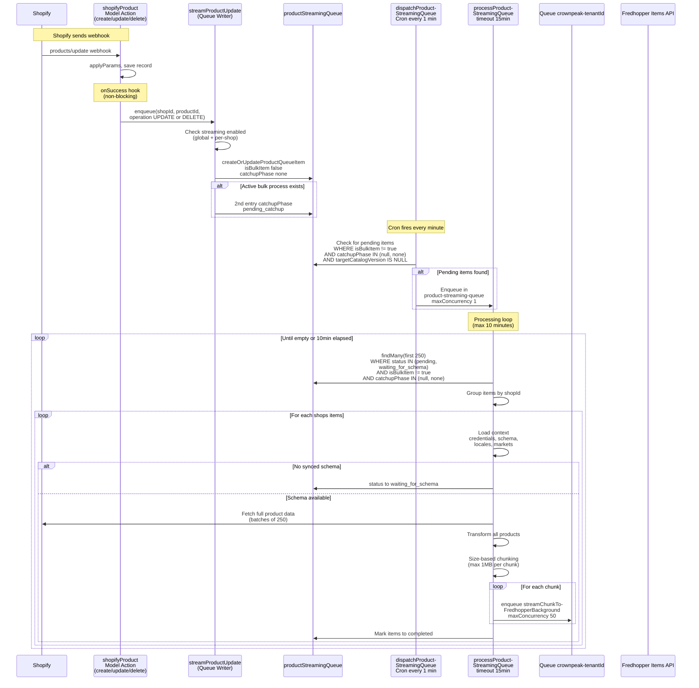
```mermaid
sequenceDiagram
    participant SHOPIFY as Shopify
    participant MODEL as shopifyProduct<br/>Model Action<br/>(create/update/delete)
    participant SPU as streamProductUpdate<br/>(Queue Writer)
    participant PSQ as productStreamingQueue
    participant DISP as dispatchProduct-<br/>StreamingQueue<br/>Cron every 1 min
    participant PROC as processProduct-<br/>StreamingQueue<br/>timeout 15min
    participant Q_FH as Queue crownpeak-tenantId
    participant FH as Fredhopper Items API

    Note over SHOPIFY,MODEL: Shopify sends webhook

    SHOPIFY ->> MODEL: products/update webhook
    MODEL ->> MODEL: applyParams, save record

    Note over MODEL: onSuccess hook<br/>(non-blocking)

    MODEL ->> SPU: enqueue(shopId, productId,<br/>operation UPDATE or DELETE)

    SPU ->> SPU: Check streaming enabled<br/>(global + per-shop)
    SPU ->> PSQ: createOrUpdateProductQueueItem<br/>isBulkItem false<br/>catchupPhase none

    alt Active bulk process exists
        SPU ->> PSQ: 2nd entry catchupPhase<br/>pending_catchup
    end

    Note over DISP: Cron fires every minute

    DISP ->> PSQ: Check for pending items<br/>WHERE isBulkItem != true<br/>AND catchupPhase IN (null, none)<br/>AND targetCatalogVersion IS NULL

    alt Pending items found
        DISP ->> PROC: Enqueue in<br/>product-streaming-queue<br/>maxConcurrency 1
    end

    Note over PROC: Processing loop<br/>(max 10 minutes)

    loop Until empty or 10min elapsed
        PROC ->> PSQ: findMany(first 250)<br/>WHERE status IN (pending,<br/>waiting_for_schema)<br/>AND isBulkItem != true<br/>AND catchupPhase IN (null, none)

        PROC ->> PROC: Group items by shopId

        loop For each shops items
            PROC ->> PROC: Load context<br/>credentials, schema,<br/>locales, markets

            alt No synced schema
                PROC ->> PSQ: status to waiting_for_schema
            else Schema available
                PROC ->> SHOPIFY: Fetch full product data<br/>(batches of 250)
                PROC ->> PROC: Transform all products
                PROC ->> PROC: Size-based chunking<br/>(max 1MB per chunk)

                loop For each chunk
                    PROC ->> Q_FH: enqueue streamChunkTo-<br/>FredhopperBackground<br/>maxConcurrency 50
                end

                PROC ->> PSQ: Mark items to completed
            end
        end
    end
```

### 4.2 Dispatcher-Worker Pattern

Gadget scheduled actions have a **fixed 15-second timeout** that cannot be overridden. The pattern uses a lightweight dispatcher as the cron target, which enqueues a heavyweight worker action via the queue system (where `timeoutMS` is respected).

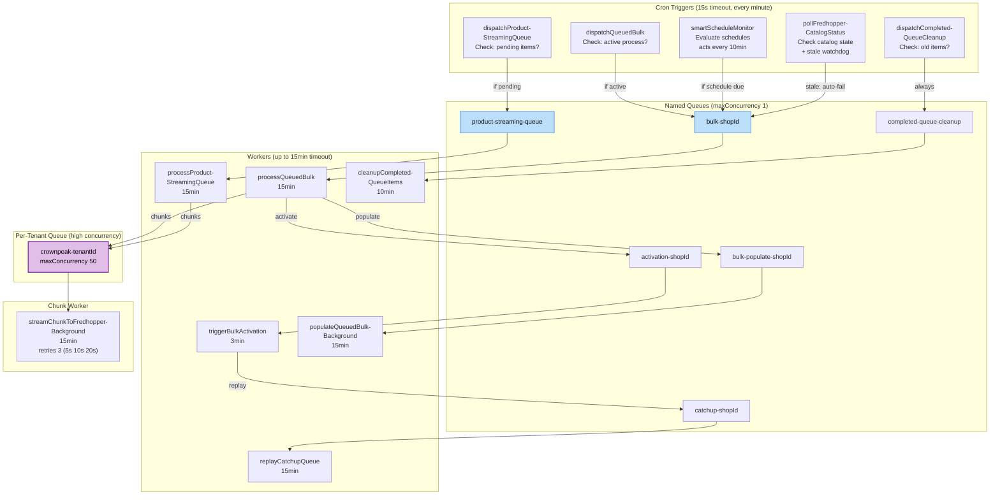
```mermaid
graph TB
    subgraph "Cron Triggers (15s timeout, every minute)"
        D_STREAM["dispatchProduct-<br/>StreamingQueue<br/>Check: pending items?"]
        D_BULK["dispatchQueuedBulk<br/>Check: active process?"]
        D_CLEANUP["dispatchCompleted-<br/>QueueCleanup<br/>Check: old items?"]
        D_SCHEDULE["smartScheduleMonitor<br/>Evaluate schedules<br/>acts every 10min"]
        D_POLL["pollFredhopper-<br/>CatalogStatus<br/>Check catalog state<br/>+ stale watchdog"]
    end

    subgraph "Named Queues (maxConcurrency 1)"
        Q_STREAM["product-streaming-queue"]
        Q_BULK["bulk-shopId"]
        Q_CLEANUP["completed-queue-cleanup"]
        Q_CATCHUP["catchup-shopId"]
        Q_ACTIVATE["activation-shopId"]
        Q_POPULATE["bulk-populate-shopId"]
    end

    subgraph "Workers (up to 15min timeout)"
        W_STREAM["processProduct-<br/>StreamingQueue<br/>15min"]
        W_BULK["processQueuedBulk<br/>15min"]
        W_CLEANUP["cleanupCompleted-<br/>QueueItems<br/>10min"]
        W_CATCHUP["replayCatchupQueue<br/>15min"]
        W_ACTIVATE["triggerBulkActivation<br/>3min"]
        W_POPULATE["populateQueuedBulk-<br/>Background<br/>15min"]
    end

    subgraph "Per-Tenant Queue (high concurrency)"
        Q_FH["crownpeak-tenantId<br/>maxConcurrency 50"]
    end

    subgraph "Chunk Worker"
        W_FH["streamChunkToFredhopper-<br/>Background<br/>15min<br/>retries 3 (5s 10s 20s)"]
    end

    D_STREAM -->|"if pending"| Q_STREAM --> W_STREAM
    D_BULK -->|"if active"| Q_BULK --> W_BULK
    D_CLEANUP -->|"always"| Q_CLEANUP --> W_CLEANUP
    D_SCHEDULE -->|"if schedule due"| Q_BULK
    D_POLL -->|"stale: auto-fail"| Q_BULK

    W_BULK -->|"chunks"| Q_FH --> W_FH
    W_STREAM -->|"chunks"| Q_FH
    W_BULK -->|"activate"| Q_ACTIVATE --> W_ACTIVATE
    W_ACTIVATE -->|"replay"| Q_CATCHUP --> W_CATCHUP
    W_BULK -->|"populate"| Q_POPULATE --> W_POPULATE

    style Q_FH fill:#e1bee7,stroke:#7b1fa2,stroke-width:2px,color:#000
    style Q_STREAM fill:#bbdefb,stroke:#1565c0,color:#000
    style Q_BULK fill:#bbdefb,stroke:#1565c0,color:#000
```

---

## 5. Product Transformation Pipeline

Both bulk and streaming flows use the same transformation pipeline to convert Shopify product data into Fredhopper's item format.

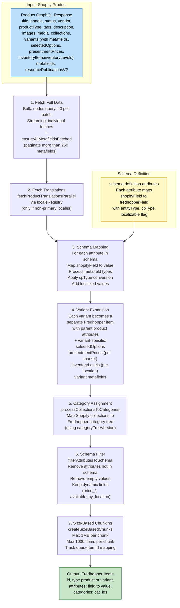
```mermaid
graph TD
    subgraph "Input: Shopify Product"
        SP["Product GraphQL Response<br/>title, handle, status, vendor,<br/>productType, tags, description,<br/>images, media, collections,<br/>variants (with metafields,<br/>selectedOptions, presentmentPrices,<br/>inventoryItem.inventoryLevels),<br/>metafields, resourcePublicationsV2"]
    end

    subgraph "Schema Definition"
        SCHEMA["schema.definition.attributes<br/>Each attribute maps<br/>shopifyField to fredhopperField<br/>with entityType, cpType,<br/>localizable flag"]
    end

    SP --> FETCH["1. Fetch Full Data<br/>Bulk: nodes query, 40 per batch<br/>Streaming: individual fetches<br/>+ ensureAllMetafieldsFetched<br/>(paginate more than 250 metafields)"]

    FETCH --> TRANSLATE["2. Fetch Translations<br/>fetchProductTranslationsParallel<br/>via localeRegistry<br/>(only if non-primary locales)"]

    TRANSLATE --> MAP["3. Schema Mapping<br/>For each attribute in schema<br/>Map shopifyField to value<br/>Process metafield types<br/>Apply cpType conversion<br/>Add localized values"]

    MAP --> VARIANTS["4. Variant Expansion<br/>Each variant becomes a<br/>separate Fredhopper item<br/>with parent product attributes<br/>+ variant-specific:<br/>selectedOptions<br/>presentmentPrices (per market)<br/>inventoryLevels (per location)<br/>variant metafields"]

    VARIANTS --> CATEGORIES["5. Category Assignment<br/>processCollectionsToCategories<br/>Map Shopify collections to<br/>Fredhopper category tree<br/>(using categoryTreeVersion)"]

    CATEGORIES --> FILTER["6. Schema Filter<br/>filterAttributesToSchema<br/>Remove attributes not in schema<br/>Remove empty values<br/>Keep dynamic fields<br/>(price_*, available_by_location)"]

    FILTER --> CHUNK["7. Size-Based Chunking<br/>createSizeBasedChunks<br/>Max 1MB per chunk<br/>Max 1000 items per chunk<br/>Track queueItemId mapping"]

    CHUNK --> OUTPUT["Output: Fredhopper Items<br/>id, type product or variant,<br/>attributes: field to value,<br/>categories: cat_ids"]

    SCHEMA --> MAP

    style SP fill:#bbdefb,stroke:#1565c0,color:#000
    style SCHEMA fill:#fff9c4,stroke:#f9a825,color:#000
    style OUTPUT fill:#c8e6c9,stroke:#2e7d32,color:#000
```

---

## 6. Smart Scheduling

The `smartScheduleMonitor` runs every minute but only acts every 10 minutes (configurable via `SCHEDULE_MONITOR_INTERVAL_MINUTES`). It evaluates all enabled schedules and decides whether to start a bulk sync.

### 6.1 Schedule Evaluation Flow

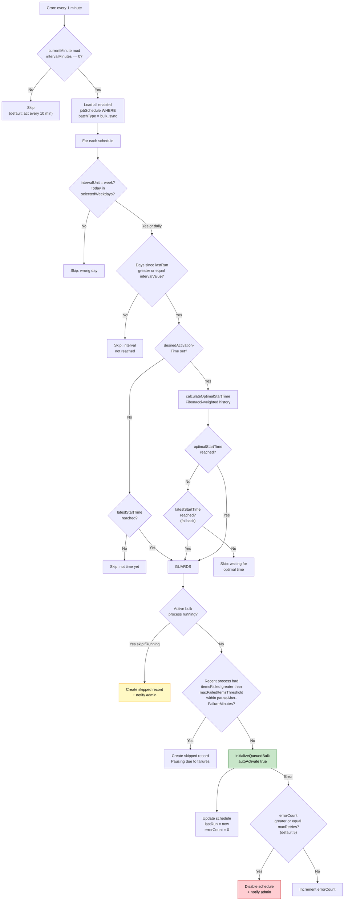
```mermaid
flowchart TD
    CRON["Cron: every 1 minute"] --> INTERVAL_CHECK{"currentMinute mod<br/>intervalMinutes == 0?"}
    INTERVAL_CHECK -->|"No"| SKIP_INTERVAL["Skip<br/>(default: act every 10 min)"]
    INTERVAL_CHECK -->|"Yes"| LOAD["Load all enabled<br/>jobSchedule WHERE<br/>batchType = bulk_sync"]

    LOAD --> LOOP["For each schedule"]

    LOOP --> DAY_CHECK{"intervalUnit = week?<br/>Today in<br/>selectedWeekdays?"}
    DAY_CHECK -->|"No"| SKIP_DAY["Skip: wrong day"]
    DAY_CHECK -->|"Yes or daily"| INT_CHECK{"Days since lastRun<br/>greater or equal intervalValue?"}
    INT_CHECK -->|"No"| SKIP_INT["Skip: interval<br/>not reached"]
    INT_CHECK -->|"Yes"| SMART{"desiredActivation-<br/>Time set?"}

    SMART -->|"No"| LATEST{"latestStartTime<br/>reached?"}
    LATEST -->|"No"| SKIP_TIME["Skip: not time yet"]
    LATEST -->|"Yes"| GUARDS

    SMART -->|"Yes"| CALC["calculateOptimalStartTime<br/>Fibonacci-weighted history"]
    CALC --> OPT{"optimalStartTime<br/>reached?"}
    OPT -->|"No"| LATEST2{"latestStartTime<br/>reached?<br/>(fallback)"}
    LATEST2 -->|"No"| SKIP_OPT["Skip: waiting for<br/>optimal time"]
    LATEST2 -->|"Yes"| GUARDS
    OPT -->|"Yes"| GUARDS

    GUARDS --> RUNNING{"Active bulk<br/>process running?"}
    RUNNING -->|"Yes skipIfRunning"| SKIPPED["Create skipped record<br/>+ notify admin"]
    RUNNING -->|"No"| FAILURES{"Recent process had<br/>itemsFailed greater than<br/>maxFailedItemsThreshold<br/>within pauseAfter-<br/>FailureMinutes?"}
    FAILURES -->|"Yes"| PAUSED["Create skipped record<br/>Pausing due to failures"]
    FAILURES -->|"No"| START["initializeQueuedBulk<br/>autoActivate true"]

    START --> UPDATE["Update schedule<br/>lastRun = now<br/>errorCount = 0"]

    START -->|"Error"| ERROR{"errorCount<br/>greater or equal maxRetries?<br/>(default 5)"}
    ERROR -->|"Yes"| DISABLE["Disable schedule<br/>+ notify admin"]
    ERROR -->|"No"| INCREMENT["Increment errorCount"]

    style START fill:#c8e6c9,stroke:#2e7d32,color:#000
    style SKIPPED fill:#fff9c4,stroke:#f9a825,color:#000
    style DISABLE fill:#ffcdd2,stroke:#c62828,color:#000
```

### 6.2 Optimal Start Time Calculation

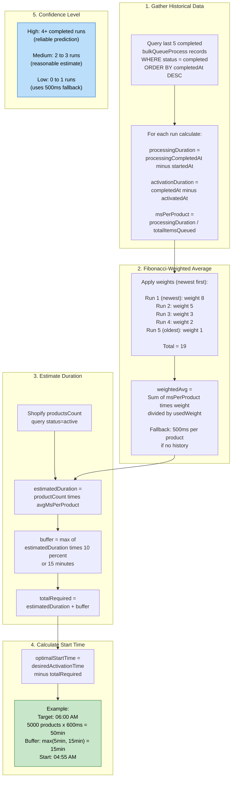
```mermaid
graph TD
    subgraph "1. Gather Historical Data"
        QUERY["Query last 5 completed<br/>bulkQueueProcess records<br/>WHERE status = completed<br/>ORDER BY completedAt DESC"]

        QUERY --> METRICS["For each run calculate:<br/><br/>processingDuration =<br/>processingCompletedAt minus startedAt<br/><br/>activationDuration =<br/>completedAt minus activatedAt<br/><br/>msPerProduct =<br/>processingDuration / totalItemsQueued"]
    end

    subgraph "2. Fibonacci-Weighted Average"
        METRICS --> WEIGHTS["Apply weights (newest first):<br/><br/>Run 1 (newest): weight 8<br/>Run 2: weight 5<br/>Run 3: weight 3<br/>Run 4: weight 2<br/>Run 5 (oldest): weight 1<br/><br/>Total = 19"]

        WEIGHTS --> AVG["weightedAvg =<br/>Sum of msPerProduct times weight<br/>divided by usedWeight<br/><br/>Fallback: 500ms per product<br/>if no history"]
    end

    subgraph "3. Estimate Duration"
        COUNT["Shopify productsCount<br/>query status=active"] --> EST

        AVG --> EST["estimatedDuration =<br/>productCount times avgMsPerProduct"]

        EST --> BUFFER["buffer = max of<br/>estimatedDuration times 10 percent<br/>or 15 minutes"]

        BUFFER --> TOTAL["totalRequired =<br/>estimatedDuration + buffer"]
    end

    subgraph "4. Calculate Start Time"
        TOTAL --> START["optimalStartTime =<br/>desiredActivationTime<br/>minus totalRequired"]

        START --> EXAMPLE["Example:<br/>Target: 06:00 AM<br/>5000 products x 600ms = 50min<br/>Buffer: max(5min, 15min) = 15min<br/>Start: 04:55 AM"]
    end

    subgraph "5. Confidence Level"
        CONF["High: 4+ completed runs<br/>(reliable prediction)<br/><br/>Medium: 2 to 3 runs<br/>(reasonable estimate)<br/><br/>Low: 0 to 1 runs<br/>(uses 500ms fallback)"]
    end

    style EXAMPLE fill:#c8e6c9,stroke:#2e7d32,color:#000
    style CONF fill:#bbdefb,stroke:#1565c0,color:#000
```

---

## 7. Queue Item Lifecycle & Cleanup

### 7.1 State Machine

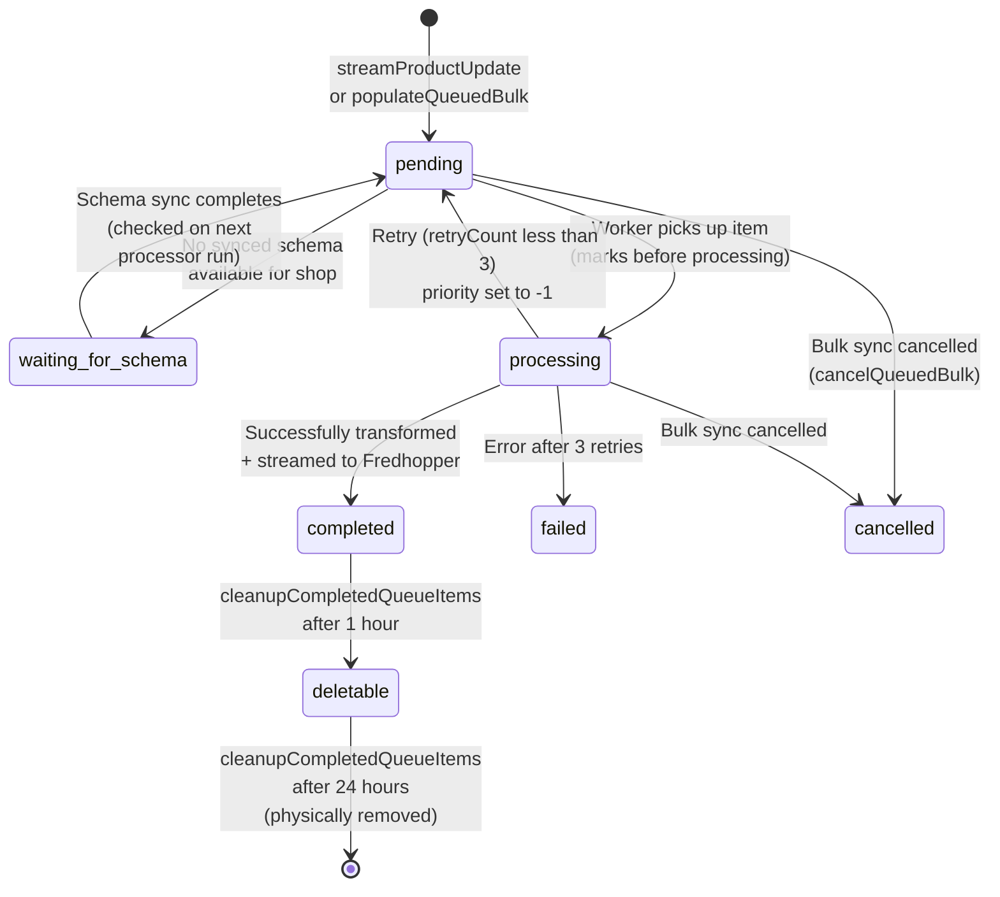
```mermaid
stateDiagram-v2
    [*] --> pending : streamProductUpdate<br/>or populateQueuedBulk

    pending --> waiting_for_schema : No synced schema<br/>available for shop
    waiting_for_schema --> pending : Schema sync completes<br/>(checked on next<br/>processor run)

    pending --> processing : Worker picks up item<br/>(marks before processing)
    processing --> completed : Successfully transformed<br/>+ streamed to Fredhopper
    processing --> pending : Retry (retryCount less than 3)<br/>priority set to -1
    processing --> failed : Error after 3 retries

    pending --> cancelled : Bulk sync cancelled<br/>(cancelQueuedBulk)
    processing --> cancelled : Bulk sync cancelled

    completed --> deletable : cleanupCompletedQueueItems<br/>after 1 hour
    deletable --> [*] : cleanupCompletedQueueItems<br/>after 24 hours<br/>(physically removed)
```

### 7.2 Cleanup Architecture

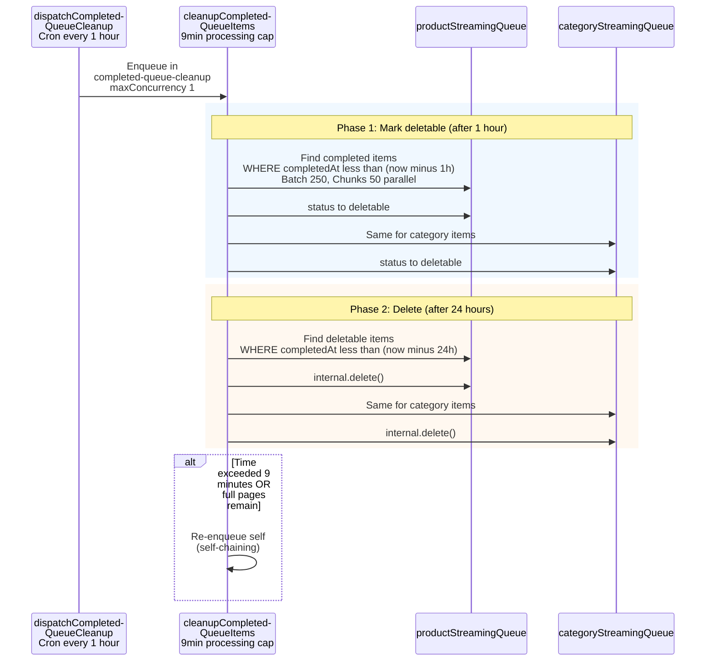
```mermaid
sequenceDiagram
    participant CRON as dispatchCompleted-<br/>QueueCleanup<br/>Cron every 1 hour
    participant CLEANUP as cleanupCompleted-<br/>QueueItems<br/>9min processing cap
    participant PSQ as productStreamingQueue
    participant CSQ as categoryStreamingQueue

    CRON ->> CLEANUP: Enqueue in<br/>completed-queue-cleanup<br/>maxConcurrency 1

    rect rgb(240, 248, 255)
        Note over CLEANUP,CSQ: Phase 1: Mark deletable (after 1 hour)
        CLEANUP ->> PSQ: Find completed items<br/>WHERE completedAt less than (now minus 1h)<br/>Batch 250, Chunks 50 parallel
        CLEANUP ->> PSQ: status to deletable

        CLEANUP ->> CSQ: Same for category items
        CLEANUP ->> CSQ: status to deletable
    end

    rect rgb(255, 248, 240)
        Note over CLEANUP,CSQ: Phase 2: Delete (after 24 hours)
        CLEANUP ->> PSQ: Find deletable items<br/>WHERE completedAt less than (now minus 24h)
        CLEANUP ->> PSQ: internal.delete()

        CLEANUP ->> CSQ: Same for category items
        CLEANUP ->> CSQ: internal.delete()
    end

    alt Time exceeded 9 minutes OR full pages remain
        CLEANUP ->> CLEANUP: Re-enqueue self<br/>(self-chaining)
    end
```

---

## 8. Stale Process Watchdog

The `pollFredhopperCatalogStatus` action (cron: every minute) performs two functions: catalog status polling and stale process detection. The watchdog prevents orphaned processes from permanently blocking the scheduler.

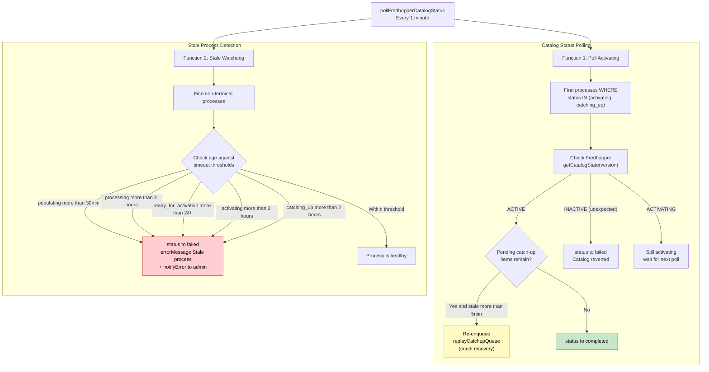
```mermaid
graph TD
    CRON["pollFredhopperCatalogStatus<br/>Every 1 minute"] --> POLL["Function 1: Poll Activating"]
    CRON --> WATCHDOG["Function 2: Stale Watchdog"]

    subgraph "Catalog Status Polling"
        POLL --> FIND_ACT["Find processes WHERE<br/>status IN (activating, catching_up)"]
        FIND_ACT --> FH_CHECK["Check Fredhopper<br/>getCatalogState(version)"]
        FH_CHECK -->|"ACTIVE"| CATCHUP_CHECK{"Pending catch-up<br/>items remain?"}
        CATCHUP_CHECK -->|"Yes and stale more than 5min"| RE_ENQ["Re-enqueue<br/>replayCatchupQueue<br/>(crash recovery)"]
        CATCHUP_CHECK -->|"No"| COMPLETE["status to completed"]
        FH_CHECK -->|"INACTIVE (unexpected)"| FAIL_1["status to failed<br/>Catalog reverted"]
        FH_CHECK -->|"ACTIVATING"| WAIT["Still activating<br/>wait for next poll"]
    end

    subgraph "Stale Process Detection"
        WATCHDOG --> FIND_STALE["Find non-terminal processes"]
        FIND_STALE --> CHECK_AGE{"Check age against<br/>timeout thresholds"}

        CHECK_AGE -->|"populating more than 30min"| AUTO_FAIL
        CHECK_AGE -->|"processing more than 4 hours"| AUTO_FAIL
        CHECK_AGE -->|"ready_for_activation more than 24h"| AUTO_FAIL
        CHECK_AGE -->|"activating more than 2 hours"| AUTO_FAIL
        CHECK_AGE -->|"catching_up more than 2 hours"| AUTO_FAIL
        CHECK_AGE -->|"Within threshold"| OK["Process is healthy"]
    end

    AUTO_FAIL["status to failed<br/>errorMessage Stale process<br/>+ notifyError to admin"]

    style COMPLETE fill:#c8e6c9,stroke:#2e7d32,color:#000
    style AUTO_FAIL fill:#ffcdd2,stroke:#c62828,color:#000
    style RE_ENQ fill:#fff9c4,stroke:#f9a825,color:#000
```

**Stale Timeout Thresholds (configurable via env vars):**

| Status | Default Timeout | Env Variable |
|--------|----------------|--------------|
| `pending` / `populating` | 30 minutes | `STALE_POPULATING_TIMEOUT_MINUTES` |
| `processing` | 4 hours | `STALE_PROCESSING_TIMEOUT_MINUTES` |
| `ready_for_activation` | 24 hours | `STALE_READY_TIMEOUT_MINUTES` |
| `activating` | 2 hours | `STALE_ACTIVATING_TIMEOUT_MINUTES` |
| `catching_up` | 2 hours | `STALE_CATCHUP_TIMEOUT_MINUTES` |

---

## 9. Data Model

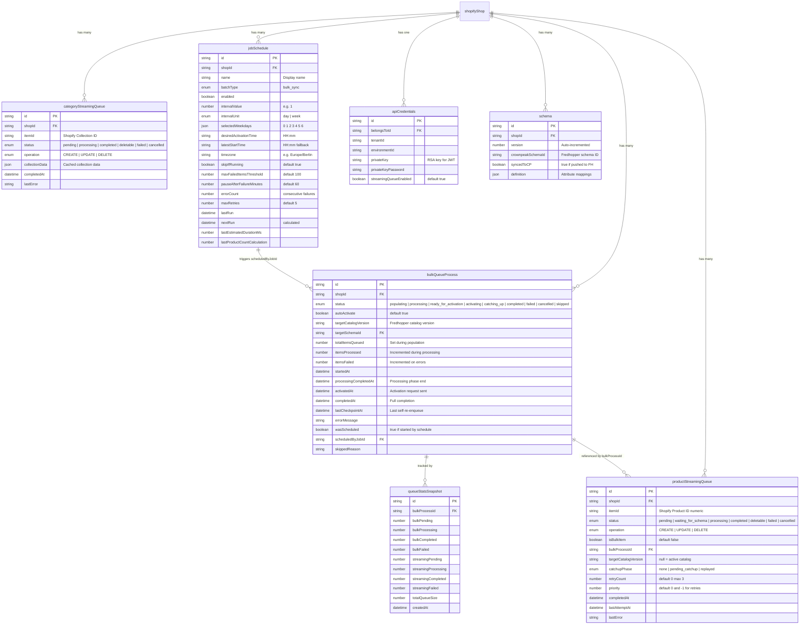
```mermaid
erDiagram
    shopifyShop ||--o{ bulkQueueProcess : "has many"
    shopifyShop ||--o{ productStreamingQueue : "has many"
    shopifyShop ||--o{ categoryStreamingQueue : "has many"
    shopifyShop ||--o{ jobSchedule : "has many"
    shopifyShop ||--o{ apiCredentials : "has one"
    shopifyShop ||--o{ schema : "has many"
    bulkQueueProcess ||--o{ queueStatsSnapshot : "tracked by"
    bulkQueueProcess ||--o{ productStreamingQueue : "referenced by bulkProcessId"
    jobSchedule ||--o{ bulkQueueProcess : "triggers scheduledByJobId"

    bulkQueueProcess {
        string id PK
        string shopId FK
        enum status "populating | processing | ready_for_activation | activating | catching_up | completed | failed | cancelled | skipped"
        boolean autoActivate "default true"
        string targetCatalogVersion "Fredhopper catalog version"
        string targetSchemaId FK
        number totalItemsQueued "Set during population"
        number itemsProcessed "Incremented during processing"
        number itemsFailed "Incremented on errors"
        datetime startedAt
        datetime processingCompletedAt "Processing phase end"
        datetime activatedAt "Activation request sent"
        datetime completedAt "Full completion"
        datetime lastCheckpointAt "Last self-re-enqueue"
        string errorMessage
        boolean wasScheduled "true if started by schedule"
        string scheduledByJobId FK
        string skippedReason
    }

    productStreamingQueue {
        string id PK
        string shopId FK
        string itemId "Shopify Product ID numeric"
        enum status "pending | waiting_for_schema | processing | completed | deletable | failed | cancelled"
        enum operation "CREATE | UPDATE | DELETE"
        boolean isBulkItem "default false"
        string bulkProcessId FK
        string targetCatalogVersion "null = active catalog"
        enum catchupPhase "none | pending_catchup | replayed"
        number retryCount "default 0 max 3"
        number priority "default 0 and -1 for retries"
        datetime completedAt
        datetime lastAttemptAt
        string lastError
    }

    categoryStreamingQueue {
        string id PK
        string shopId FK
        string itemId "Shopify Collection ID"
        enum status "pending | processing | completed | deletable | failed | cancelled"
        enum operation "CREATE | UPDATE | DELETE"
        json collectionData "Cached collection data"
        datetime completedAt
        string lastError
    }

    jobSchedule {
        string id PK
        string shopId FK
        string name "Display name"
        enum batchType "bulk_sync"
        boolean enabled
        number intervalValue "e.g. 1"
        enum intervalUnit "day | week"
        json selectedWeekdays "0 1 2 3 4 5 6"
        string desiredActivationTime "HH:mm"
        string latestStartTime "HH:mm fallback"
        string timezone "e.g. Europe/Berlin"
        boolean skipIfRunning "default true"
        number maxFailedItemsThreshold "default 100"
        number pauseAfterFailureMinutes "default 60"
        number errorCount "consecutive failures"
        number maxRetries "default 5"
        datetime lastRun
        datetime nextRun "calculated"
        number lastEstimatedDurationMs
        number lastProductCountCalculation
    }

    queueStatsSnapshot {
        string id PK
        string bulkProcessId FK
        number bulkPending
        number bulkProcessing
        number bulkCompleted
        number bulkFailed
        number streamingPending
        number streamingProcessing
        number streamingCompleted
        number streamingFailed
        number totalQueueSize
        datetime createdAt
    }

    apiCredentials {
        string id PK
        string belongsToId FK
        string tenantId
        string environmentId
        string privateKey "RSA key for JWT"
        string privateKeyPassword
        boolean streamingQueueEnabled "default true"
    }

    schema {
        string id PK
        string shopId FK
        number version "Auto-incremented"
        string crownpeakSchemaId "Fredhopper schema ID"
        boolean syncedToCP "true if pushed to FH"
        json definition "Attribute mappings"
    }
```

---

## 10. Queue Architecture — Summary Table

| Queue Name | Concurrency | Timeout | Triggered By | Purpose |
|-----------|:-----------:|:-------:|-------------|---------|
| `product-streaming-queue` | 1 | 15 min | `dispatchProductStreamingQueue` (cron 1min) | Process webhook-driven product updates |
| `bulk-{shopId}` | 1 | 15 min | `dispatchQueuedBulk` (cron 1min), `initializeQueuedBulk` | Process bulk queue items, self-re-enqueue |
| `bulk-populate-{shopId}` | 1 | 15 min | `initializeQueuedBulk` | Fetch all product IDs from Shopify |
| `activation-{shopId}` | 1 | 3 min | `processQueuedBulk` | Flush + activate + start replay |
| `catchup-{shopId}` | 1 | 15 min | `triggerBulkActivation`, `pollFredhopperCatalogStatus` | Replay catch-up items to active catalog |
| `crownpeak-{tenantId}` | **50** | 15 min | `processQueuedBulk`, `processProductStreamingQueue` | Stream chunks to Fredhopper Items API |
| `completed-queue-cleanup` | 1 | 10 min | `dispatchCompletedQueueCleanup` (cron 1h) | Mark deletable + physically delete old items |

### Retry Configuration (for `{tenantId}` queue)

| Parameter | Default | Env Variable |
|-----------|---------|-------------|
| Retry count | 3 | `QUEUE_RETRY_COUNT` |
| Initial interval | 5 seconds | `QUEUE_INITIAL_INTERVAL` |
| Backoff factor | 2x | `QUEUE_BACKOFF_FACTOR` |
| Max interval | 2 minutes | `QUEUE_MAX_INTERVAL` |

---

## 11. Configuration Reference

All parameters are configurable via environment variables with sensible defaults.

### Processing Parameters

| Parameter | Default | Env Variable | Used By |
|-----------|---------|-------------|---------|
| Max payload size | 1 MB | `FREDHOPPER_MAX_PAYLOAD_SIZE_BYTES` | Chunk creation |
| Max items per chunk | 1,000 | `FREDHOPPER_CHUNK_SIZE` | Chunk creation |
| Shopify batch size | 250 | `SHOPIFY_BATCH_SIZE` | GraphQL queries |
| Items per streaming run | 250 | `MAX_ITEMS_PER_RUN` | `processProductStreamingQueue` |
| Bulk fetch batch size | 40 | hardcoded | `processQueuedBulk` nodes() query |
| Inventory levels batch | 100 | hardcoded | Separate inventoryLevels fetch |
| Streaming globally enabled | true | `STREAMING_QUEUE_ENABLED` | `streamProductUpdate` |
| Population batch size | 200 | hardcoded | `populateQueuedBulkBackground` |

### Timing Parameters

| Parameter | Default | Env Variable | Used By |
|-----------|---------|-------------|---------|
| Worker re-enqueue threshold | 10 minutes | hardcoded | `processQueuedBulk`, `processProductStreamingQueue` |
| Activation grace period | 10 seconds | hardcoded | `triggerBulkActivation` |
| Cleanup retention (completed) | 1 hour | hardcoded | `cleanupCompletedQueueItems` |
| Cleanup retention (deletable) | 24 hours | hardcoded | `cleanupCompletedQueueItems` |
| Cleanup processing cap | 9 minutes | hardcoded | `cleanupCompletedQueueItems` |
| Schedule monitor interval | 10 minutes | `SCHEDULE_MONITOR_INTERVAL_MINUTES` | `smartScheduleMonitor` |

### Stale Watchdog Timeouts

| Status | Default | Env Variable |
|--------|---------|-------------|
| pending / populating | 30 min | `STALE_POPULATING_TIMEOUT_MINUTES` |
| processing | 4 hours | `STALE_PROCESSING_TIMEOUT_MINUTES` |
| ready_for_activation | 24 hours | `STALE_READY_TIMEOUT_MINUTES` |
| activating | 2 hours | `STALE_ACTIVATING_TIMEOUT_MINUTES` |
| catching_up | 2 hours | `STALE_CATCHUP_TIMEOUT_MINUTES` |

---

## Appendix: Source File Index

| Diagram Section | Key Source Files |
|----------------|-----------------|
| Bulk Sync Initialization | `api/actions/initializeQueuedBulk.ts` |
| Queue Population | `api/actions/populateQueuedBulkBackground.ts` |
| Bulk Processing | `api/actions/processQueuedBulk.ts` |
| Chunk Streaming | `api/actions/streamChunkToFredhopperBackground.ts` |
| Activation and Catch-Up | `api/actions/triggerBulkActivation.ts`, `flushInactiveQueueBeforeActivation.ts`, `replayCatchupQueue.ts` |
| Streaming Updates | `api/actions/processProductStreamingQueue.ts`, `dispatchProductStreamingQueue.ts` |
| Webhook Handling | `api/actions/streamProductUpdate.ts`, `api/models/shopifyProduct/actions/update.ts`, `delete.ts` |
| Smart Scheduling | `api/actions/smartScheduleMonitor.ts`, `calculateOptimalStartTime.ts` |
| Catalog Status and Watchdog | `api/actions/pollFredhopperCatalogStatus.ts` |
| Queue Cleanup | `api/actions/cleanupCompletedQueueItems.ts`, `dispatchCompletedQueueCleanup.ts` |
| Configuration | `api/config/chunkConfig.ts` |
| Transformation | `api/utils/productTransform.ts`, `api/utils/translationFetcher.ts`, `api/utils/localeRegistry.ts` |
| Authentication | `api/utils/authManager.ts` (JWT `getBearerToken`, `retryFetch`) |
