# Architecture

This document describes the technical architecture of the Fredhopper Shopify App, focusing on how product data flows from Shopify to Fredhopper through queue-based processing.

## System Overview

The app runs on the [Gadget](https://gadget.dev) platform and uses a **queue-based architecture** for all data synchronization between Shopify and Fredhopper. There are two primary data flows:

* **Bulk Sync** — a full catalog rebuild that processes all products from Shopify into a new inactive Fredhopper catalog, then activates it.
* **Streaming Updates** — real-time product changes via Shopify webhooks, queued and streamed to the active Fredhopper catalog.

Both flows share the same `productStreamingQueue` model, distinguished by the `isBulkItem` flag.

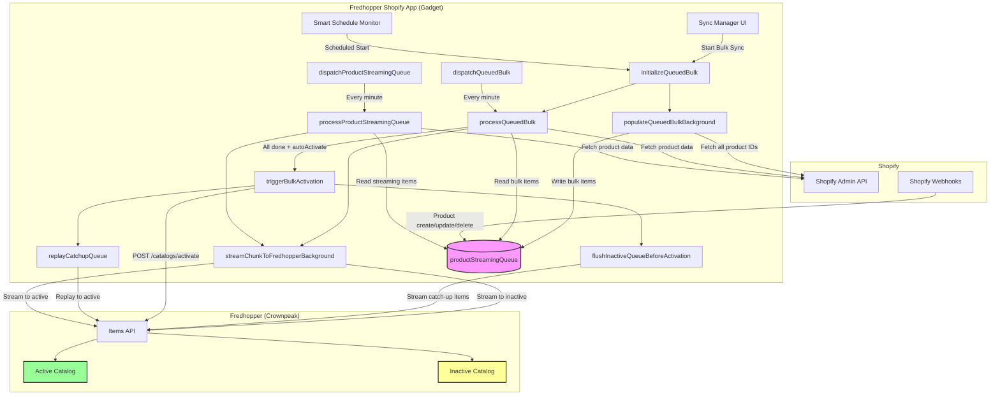

## Bulk Sync Flow

A bulk sync is the process of rebuilding an entire Fredhopper catalog from scratch. It is triggered either manually from the Sync Manager or automatically via the Smart Schedule Monitor.

### Bulk Sync Lifecycle

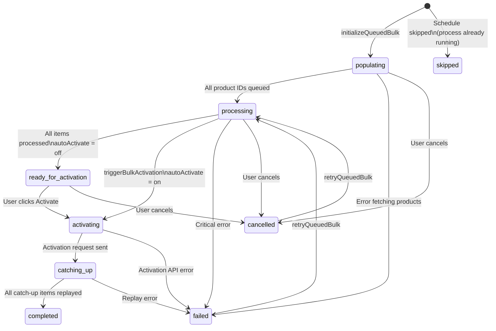

### Bulk Sync Step-by-Step

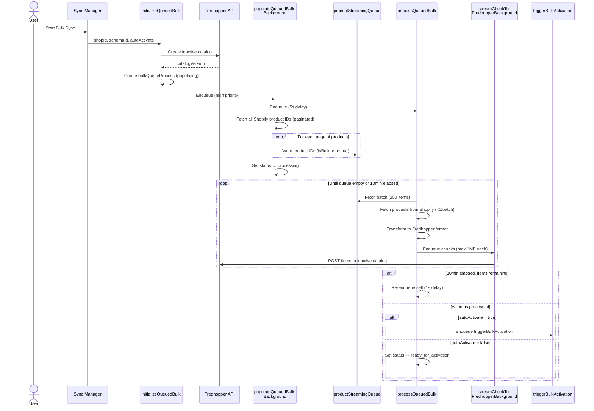

### Self-Re-Enqueueing Pattern

The bulk processor uses a **self-re-enqueueing pattern** to work around the 15-minute execution timeout of the Gadget platform. After processing items for 10 minutes, the processor saves a checkpoint and enqueues itself with a 1-second delay. This creates a continuous processing chain that runs until every item is processed.

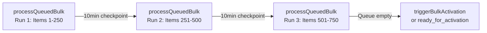

## Streaming Updates Flow

Streaming updates handle real-time product changes from Shopify. When a product is created, updated, or deleted, a Shopify webhook triggers the creation of a queue item.

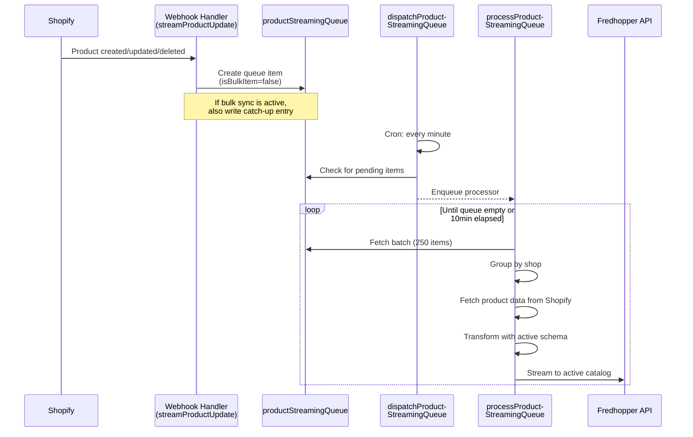

### Dispatcher-Worker Pattern

Both bulk and streaming flows use a **dispatcher-worker pattern**:

* **Dispatcher** (lightweight, 15s timeout): Runs on a cron schedule (every minute), checks for pending work, and enqueues the worker.
* **Worker** (heavyweight, 15min timeout): Processes items in batches, with self-re-enqueueing for long-running operations.

Named queues with `maxConcurrency: 1` ensure that only one worker instance runs per shop at a time, preventing duplicate processing.

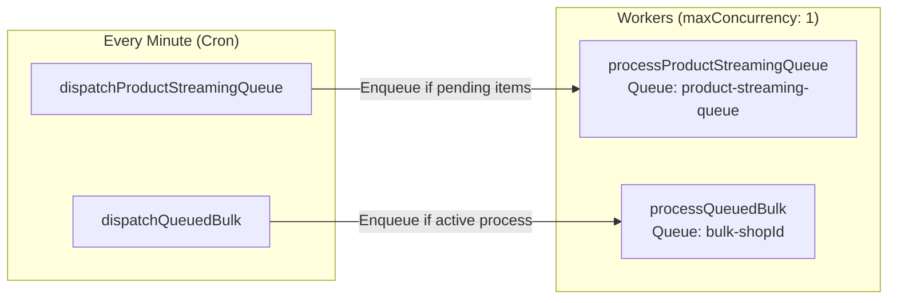

## Catch-Up Mechanism

The catch-up mechanism ensures that no product updates are lost when a bulk sync is running. It uses a **dual-write strategy** for webhook events.

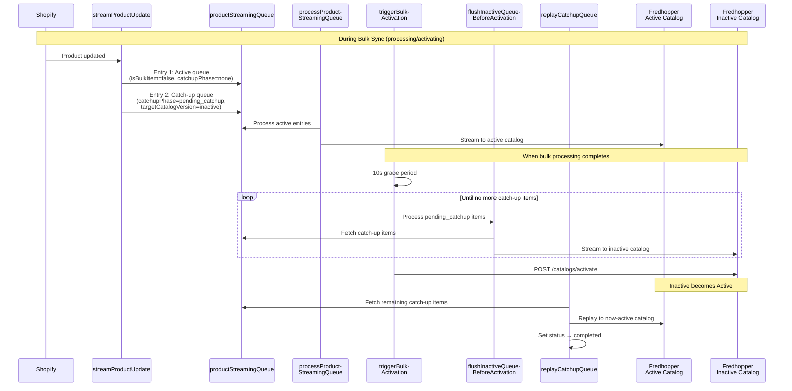

### Catch-Up Phases

| Phase | Description |
|-------|-------------|
| `none` | Normal streaming item, not related to bulk sync |
| `pending_catchup` | Webhook event received during bulk sync, waiting to be flushed/replayed |
| `replayed` | Catch-up item has been successfully replayed after catalog activation |

## Queue Item Lifecycle

All items in the `productStreamingQueue` follow a standardized lifecycle with automated cleanup.

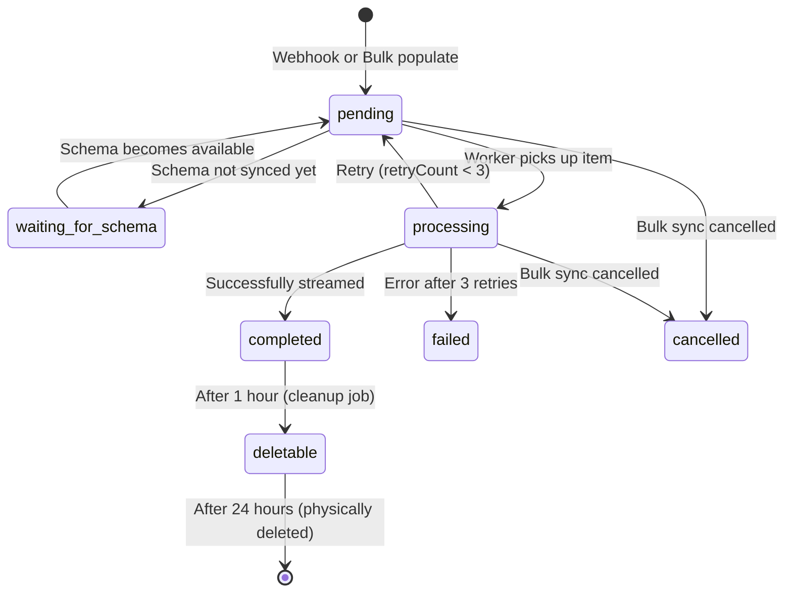

### Cleanup Process

A hourly cron job (`dispatchCompletedQueueCleanup`) triggers the cleanup worker:

1. **Phase 1**: Completed items older than 1 hour are marked as `deletable`.
2. **Phase 2**: Deletable items older than 24 hours are physically removed from the database.

This two-phase approach keeps recent items available for debugging while preventing unbounded queue growth.

## Smart Scheduling

The Smart Schedule Monitor runs every minute and evaluates configured schedules to determine if a bulk sync should be started.

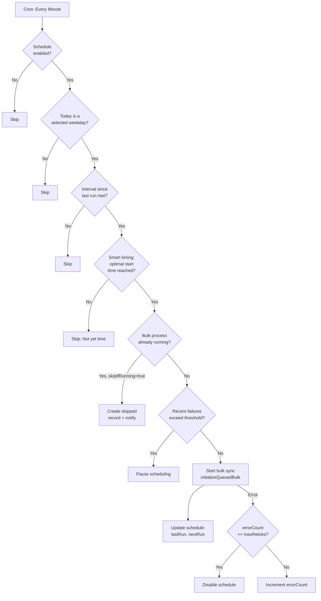

### Optimal Start Time Calculation

When a **desired activation time** is configured, the scheduler uses historical data to calculate when the bulk sync should start so that it completes on time.

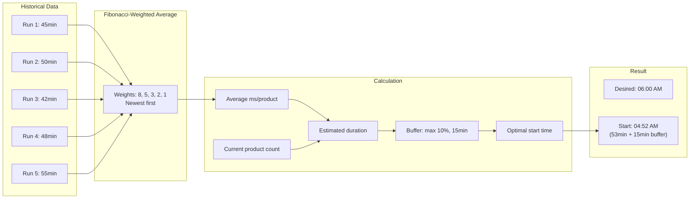

**Confidence levels** based on available history:

| Level | Runs | Description |
|-------|------|-------------|
| **High** | 4+ | Reliable prediction based on sufficient data points |
| **Medium** | 2–3 | Reasonable estimate that may vary |
| **Low** | 0–1 | Uses default of 500ms/product, recommend monitoring |

## Data Model

### Core Models

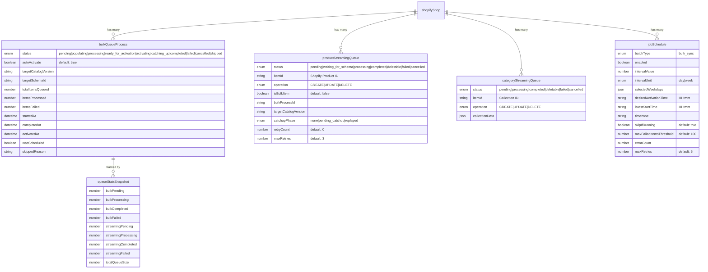

## Configuration

Key processing parameters are centrally configured and can be overridden via environment variables:

| Parameter | Default | Description |
|-----------|---------|-------------|
| `MAX_PAYLOAD_SIZE_BYTES` | 1 MB | Maximum payload size per Fredhopper API request |
| `FREDHOPPER_CHUNK_SIZE` | 1000 | Maximum items per Fredhopper API request |
| `SHOPIFY_BATCH_SIZE` | 250 | Shopify GraphQL query batch size |
| `QUEUE_MAX_CONCURRENCY` | 50 | Maximum parallel streams per tenant |
| `QUEUE_RETRY_COUNT` | 3 | Retry attempts per queue item |
| `QUEUE_BACKOFF_FACTOR` | 2 | Exponential backoff multiplier for retries |
| `MAX_ITEMS_PER_RUN` | 250 | Items processed per streaming run |
| `STREAMING_QUEUE_GLOBALLY_ENABLED` | true | Global on/off switch for streaming processing |
