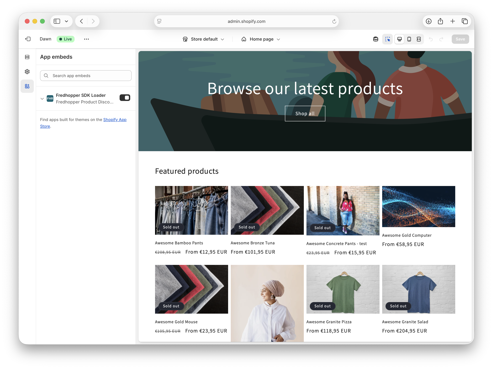
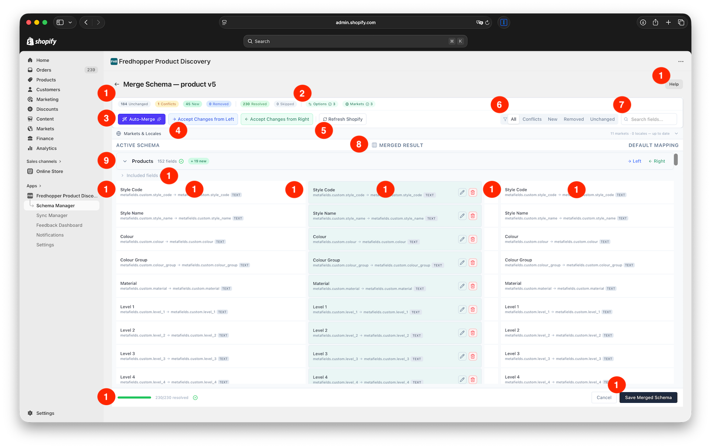
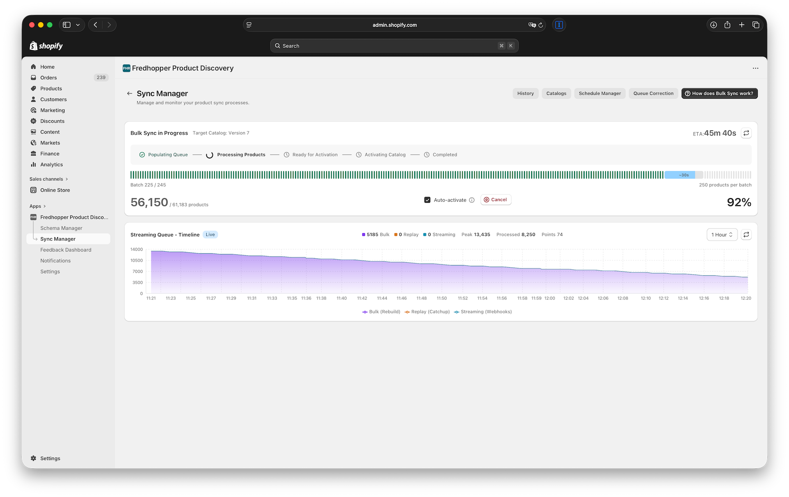
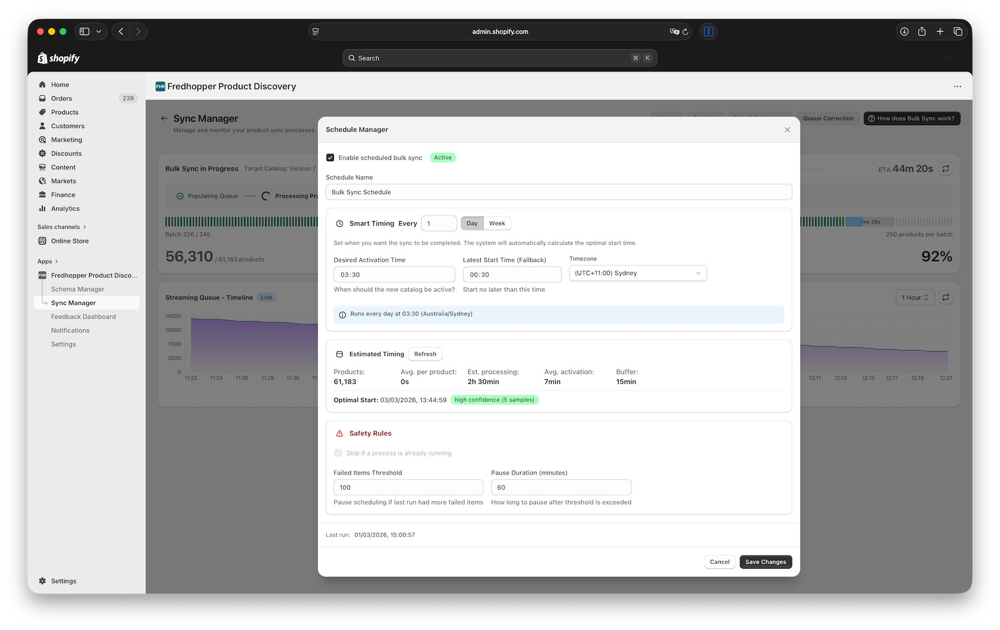
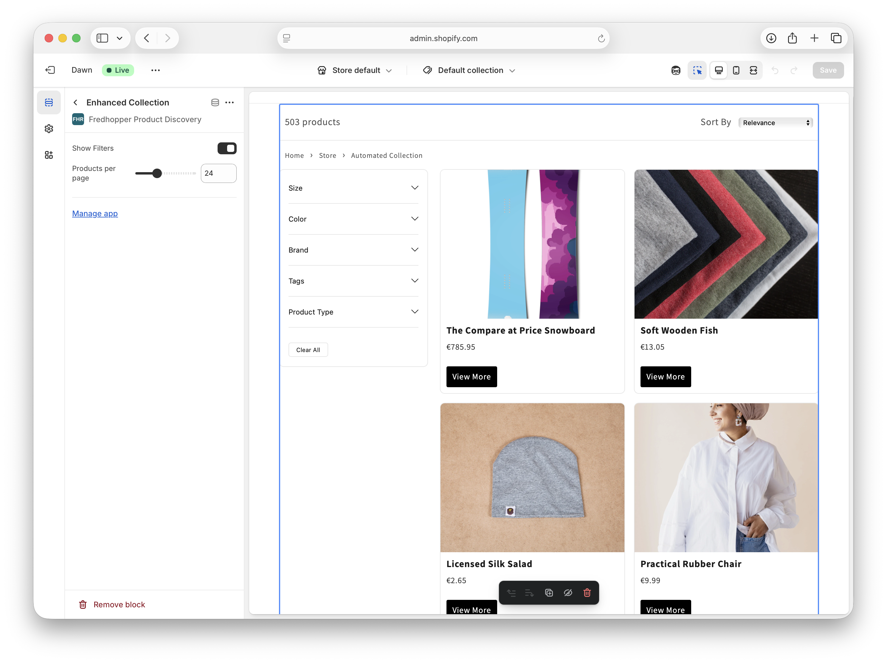

# User Guide

## 1. Installing the app

To install the app inside your Shopify store, visit the App Store and type Fredhopper, or use the following URL: [Fredhopper Product Discovery](https://apps.shopify.com/fredhopper-product-discovery)

Click the install button and when prompted give the app the necessary permissions.

The app is now installed and is ready to be configured.

Contact your CSM, Technical Consultant, or onboarding team so they can configure the app for you and ensure it can communicate with your Fredhopper instance.

Once the app has been configured, you can start to use the features of the app.

### 1.1. Installing the Web Pixel

The Fredhopper tracking pixel extension allows click data to be sent to Fredhopper’s tracker to power features such as A/B testing, insights, and AI scores.

To install the pixel, click the Install Pixel Extension button on the Settings page of the app.

For more information on the Pixel Extension, please view the [Web-Pixel Integration](../web-pixel/README.md)

You can remove the Web Pixel at any time by clicking the Remove Pixel Extension button.

### 1.2. Enabling the JavaScript SDK

The [JavaScript SDK](../sdk/README.md) allows developers to integrate Fredhopper into your front-end themes and blocks. The SDK adds an object to the window that you can use to make calls to the Fredhopper Query API via the Shopify App Proxy, adding the necessary filters to each call, and receiving the results to render on the page.

You can enable the SDK via the Settings page of the app by clicking the Enable Fredhopper SDK button, or by visiting the Theme Editor within Shopify Admin, selecting the App Embeds panel, and toggling the Fredhopper SDK Loader.

For more information on using the SDK, please view the [SDK Documentation](../sdk/README.md)

## 2. Fredhopper Data Flow

Fredhopper operates on the concept of an active Catalog, which is paired with both a Schema and a Category Tree.
- The Schema defines all fields and field types that make up product data in the Fredhopper catalog (including standard attributes and Shopify metafields).
- The Category Tree defines how products are categorised within Fredhopper. When using Shopify, this Category Tree is derived from — and mapped directly to — Shopify Collections.

Schemas are managed through the Schema Manager. A Category Tree is automatically generated each time a new Catalog is created, which happens during a Bulk Sync.

>Note
>
>The Schema and Category Tree assigned to a Catalog are immutable. Once created, they cannot be edited or amended.
>As a result, any new metafields or Collections added in Shopify after the Catalog is created will not be reflected in Fredhopper until a new Bulk Sync is performed.

### 2.1. Data Synchronisation Modes

The app sends data to Fredhopper using two mechanisms:
1. Full Catalog Sync (Bulk Sync)
Creates a new Catalog and generates the associated Schema and Category Tree, then ingests the complete product dataset.
2. Incremental Updates (Streaming Queue)
Continuously pushes product changes (creates, updates, deletes) to keep Fredhopper in sync with Shopify.

### 2.2. Bulk Sync

The Bulk Sync feature sends the complete product dataset from Shopify to Fredhopper.

When a Schema (created via the Schema Manager) is selected, Bulk Sync performs the following steps:
1. Creates a new Category Tree based on Shopify Collections.
2. Creates a new inactive Catalog with the selected Schema and newly generated Category Tree.
3. Streams the full product dataset from Shopify into Fredhopper.
4. Activates the new catalog in Fredhopper

Once activated, it becomes the new active Catalog in Fredhopper and fully replaces the existing product data in Fredhopper with the newly synced dataset.

### 2.3. Incremental Updates

The Incremental Updates feature keeps the active Catalog in sync with Shopify by processing product changes (create, update, delete) as they occur.

Updates are applied to the active Catalog using the Schema and Category Tree currently assigned to that Catalog. These structures act as the template for all incoming changes.

>Note
>
>If a new Collection or metafield is created in Shopify after the most recent Bulk Sync, Incremental Updates will ignore these fields.
>This is because they are not defined in the current Schema or Category Tree.
>
>To include new Collections or metafields:
>- Run a new Bulk Sync to regenerate the Category Tree.
>- If new metafields are required, first create a new Schema that includes those fields, then run a Bulk Sync.

## 3. Using the Schema Manager

The Schema Manager allows you to create a schema that tells Fredhopper both the shape and type of data that the app will be sending from Shopify to Fredhopper. This allows Fredhopper to have an understanding of the data and defines how it can be used in Fredhopper when creating facets, rankings and other rules.

The Schema Manager displays the data fields within Shopify and allows them to be mapped to types in Fredhopper. You can add, remove, or adjust these.

>Note on changing Fredhopper Data Types
>
>The Schema Manager allows you to override the default Fredhopper field type, which is initially derived from the corresponding Shopify data type.
>
>This setting only changes how data is structured in Fredhopper — it does not transform or convert the underlying Shopify data when it is sent.
>
>Use this feature with caution. Selecting an incompatible Fredhopper type can cause sync failures. Before making changes, ensure that the Shopify data type is compatible with the chosen Fredhopper field type.
>

The main screen within the Schema Manager lists the schemas that have been created within the app. The most recent schema is listed at the top, and the previous 20 schemas are listed in an expandable list. The schema that is currently being used by the active catalog is marked as *Active*.

The Schema editor window uses a three-panel layout to help you merge an existing Schema with the default Shopify field mapping, allowing you to create a new or updated Schema definition. This approach preserves any previous customisations, resolving any conflicts, whilst adding any new fields that may have been added to Shopify since the last schema was created.

### 3.1. Creating Schemas

There are two ways to create a new Schema:
1. **Create New Schema** - Loads the currently active Schema, if available, into the editor as the starting point.
2. **Use as Template** - Loads a previously created Schema into the editor, using it as the basis for merging and refinement.

### 3.1.1. Metafield Support

In addition to the standard product fields (which are fixed within the app), the app supports most Shopify metafield formats. Alongside basic metafield types, the app also processes and transforms data from supported reference-type metafields and metaobjects, converting them into structures that Fredhopper can consume. This makes the data available for facets, rankings, and result modifications within Fredhopper.

>Note on Metafields and Metaobjects
>
>Not all reference-type metafields or metaobjects can be transformed, as some have unknown or dynamic structures. Certain reference metafields are pre-processed, while others are passed through as the ID of the referenced object or a raw JSON.
>
>Where possible, metaobjects are sent to Fredhopper as a collection of fields in JSON format. Although this data may appear as raw JSON in Fredhopper, it can still be useful for forwarding to the frontend for custom processing. These fields can be excluded from a Schema using the Schema Manager if required.
>
>The following metafield reference types are automatically excluded:
>- Customer
>- Company
>- Collection
>- Page

### 3.1.2. Variant Options

Shopify supports up to three variant option fields per product (for example: Size, Color, Material). These option fields are text-based and scoped to individual products, even when option names overlap across the catalog.

To make variant options usable within Fredhopper, the app automatically creates dedicated fields in Fredhopper for every unique option name found across all Shopify products. This enables consistent filtering and merchandising (via facets and result modifications) across all variants that share the same option name, regardless of how Shopify stores the data.

For example, if any product variant includes an option named Size, the app will create an option_size field in the Schema. During data sync, the corresponding variant values (for example, S, M, L) are assigned to this field in Fredhopper, allowing you to build a Size facet.

These option fields are generated automatically during Schema creation and updates. They cannot be manually configured.

### 3.1.3. Shopify Markets

A custom attribute is automatically created for Shopify Markets to indicate which Markets each product belongs to. This attribute can be used on the frontend via custom triggers in Fredhopper to filter products by Market.

Markets are also used to determine which price fields are generated to support market-specific pricing (for example: *price_GB*, *price_US*, *price_DE*). This enables Fredhopper to apply correct pricing per Market during search, filtering, and merchandising.

### 3.2. Using the three-panel Schema Editor

The three-panel Schema Editor allows you to create a new Schema based on an existing one, preserving previous customisations while enabling the addition of new metafields and providing the ability to revert previously edited fields back to their default mappings.

The Schema Editor loads the active or selected Schema in the left-hand panel and the default schema mapping in the right-hand panel, with the center panel showing the result of the merged changes that will become the new schema.

**The top of the three-panel layout provides a list of field differences (1):**
- Unchanged - fields that match the selected schema and the default mapping
- Conflicts - fields that differ between the selected schema and the default mapping and need resolution
- New - new fields found in Shopify but not currently in the selected schema
- Removed - fields found in the selected schema but no longer in Shopify

**The top panel also shows the live data fetching for (2):**
- Options - collects all the product variant options from Shopify (e.g. Size, Color, etc) for inclusion in the schema
- Markets - loads the active Shopify Markets and their locales/countries
- Prices - uses the country codes from Markets to generate the localised price fields (e.g price_GB, price_US, etc.)

**Auto-Merge (3):**
- One click to automatically resolve all safe changes. Accepts unchanged fields, adds new fields, and marks removed fields as skipped. Only true conflicts are left for manual resolution.

**Bulk Accept (4):**
- Accept All Left: Keep all values from your current active schema. 
- Accept All Right: Accept all values from the freshly generated Shopify mapping. Useful when you trust one side entirely.

**Refresh from Shopify (5):**
- Manually re-fetch the fresh default mapping from your Shopify store. Scans current product data, metafields, and options to generate an up-to-date schema. Note: Options, markets, and prices are already fetched automatically when you enter the merge editor. Use this button if you've changed Shopify data mid-session.

**Filter the list by item status (6):**
- All — Show everything
- Conflicts — Only differing items e.g. the Fredhopper Type is different to the default mapping
- New — Only items from Shopify not in your schema
- Removed — Only items in your schema not in Shopify
- Unchanged — Only identical items on both sides

**Search Fields (7):**
- Type to filter fields by name. Works across both the active schema and default mapping columns. Quickly find fields like 'price', 'title', or metafield names.

**The merge editor has three columns (8):**
- Active Schema (Left) — Your current saved schema
- Merged Result (Center) — The final result that will be saved
- Default Mapping (Right) — Freshly generated from Shopify. Resolve each row by choosing left, right, or editing the merge.

**Entity Groups (9):**
- Fields are grouped by entity type — Products and Variants. Each group shows field count, resolution progress, conflict/new/removed badges, and group-level bulk accept buttons.

**Merge Rows - Each row shows a single field across all three panels. The left border color indicates its status (10):**
- 🟡 Amber = Conflict (values differ)
- 🟢 Green = New (only in Shopify)
- 🔵 Blue = Removed (only in your schema) 

**Merge Rows - Active Schema (Left) (11):**
- Shows the field mapping from your current saved schema. You'll see the Shopify field name, its mapped Fredhopper attribute, and the attribute type. If empty, the field doesn't exist in your active schema.

**Merge Rows - Accept Left (12):**
- Click the arrow button to accept the value from your active schema (left side) as the merged result. The center panel will update immediately.

**Merge Rows - Merged Result (Center) (13):**
- The center panel shows the final merged value. You can:
- ✏️ Edit — Change the Fredhopper attribute type
- 🗑️ Skip — Exclude this field from the schema
- ✅ Restore — Bring back a skipped field. "Pick a side" means this conflict still needs resolution.

**Merge Rows - Accept Right (14):**
- Click the arrow button to accept the value from the default Shopify mapping (right side). Use this when the fresh mapping has the correct or updated value.

**Merge Rows - Default Mapping (Right) (15):**
- Shows the freshly generated field mapping from Shopify. This reflects the current state of your Shopify store's product data — including metafields, product options, localized price fields from active markets, and standard fields. Auto-refreshes when live data finishes loading.

**Included Fields (16):**
- These are required or system-managed fields that are always part of the schema and cannot be removed. They are resolved automatically. Click the > button to expand the list to view the fields.

**Progress & Save (17):**
- The progress bar shows how many items are resolved out of the total. • All items must be resolved (or skipped) before you can save.
- "Save Merged Schema" creates a new version and syncs it to Fredhopper
- The save button glows when you're ready to save ✨

**Save Merged Schema (18):**
- When all items are resolved, click this button to save the merged schema as a new version. It will be synced to Fredhopper automatically. The button is disabled until all data is loaded and all conflicts are resolved.

**Help (19):**
- Click on the help button to view the guided tour.

Once the schema has been created, you can use the [Sync Manager](#using-the-sync-manager) to run a full catalog sync using that schema or you can wait for the next [scheduled catalog sync](#setting-a-schedule) to happen.

## 4. Using the Sync Manager

The Sync Manager is the central hub for managing product data synchronization between Shopify and Fredhopper. It consolidates catalog creation, bulk sync processing, streaming queue monitoring, and scheduling into a single page.

You can access the Sync Manager via the **Sync Manager** navigation item in the app sidebar.

### 4.1. Starting a Bulk Sync

A bulk sync transfers all product data from Shopify to a new Fredhopper catalog. To start one:

1. Select the **Schema** to use. Only schemas that have been synced to Fredhopper are available. The latest version is selected by default.
2. Choose whether **auto-activate** should be enabled (it is on by default).
3. Click **Start Bulk Sync**.

The app will then:

1. Create an **inactive catalog** in Fredhopper and sync the category tree.
2. **Populate** the processing queue with all active Shopify product IDs.
3. **Process** the queue: products are fetched from Shopify, transformed using the selected schema, and streamed to the inactive Fredhopper catalog.
4. Once all items are processed:
   * **Auto-activate on**: The catalog is automatically activated in Fredhopper. Any webhook updates that arrived during processing are caught up via the catch-up mechanism (see [Streaming Updates](#streaming-updates)).
   * **Auto-activate off**: The process pauses at the **Ready for Activation** status. You can then activate manually by clicking the **Activate** button.

You can toggle the auto-activate setting at any time during the process — even while syncing is already in progress.

### 4.2. Bulk Sync Progress

The Sync Manager displays real-time progress through the following phases:

| Phase | Description |
|-------|-------------|
| **Populating** | Product IDs are being fetched from Shopify and written to the processing queue |
| **Processing** | Products are being transformed and streamed to the inactive Fredhopper catalog |
| **Ready for Activation** | All items processed, waiting for manual activation (only when auto-activate is off) |
| **Activating** | The activation request has been sent to Fredhopper; catch-up items are being flushed |
| **Catching Up** | Webhook updates received during processing are being replayed to the now-active catalog |
| **Completed** | Bulk sync finished successfully |

Additional statuses include **Failed**, **Cancelled**, and **Skipped** (when the scheduler skips a run because a process is already active).

You can **cancel** a running bulk sync or **retry** a failed one directly from the Sync Manager.

### 4.3. Bulk Sync History

The Sync Manager shows a history of the last 20 bulk sync processes with their status, duration, item counts, and error information.

### 4.4. Streaming Queue Chart

A real-time chart visualizes the throughput of the streaming queue during a bulk sync, showing pending, processing, completed, and failed item counts over time.

### 4.5. Queue Correction

The **Queue Correction** tool (accessible via the page header) allows you to repair stuck or inconsistent queue items. This is useful in rare cases where items get stuck in a processing state.

### 4.6. Preparing a Catalog Without Activating

If you want to prepare a full data sync without immediately activating the catalog in Fredhopper, start a bulk sync with **auto-activate turned off**. The process will complete all data processing and stop at the **Ready for Activation** status. You can then:

* Click **Activate** to activate the catalog when ready.
* Or start a new bulk sync to discard the prepared catalog.

This is useful for validating data before going live or timing a catalog activation for a specific moment.

### 4.7. Manual Sync vs. Scheduled Sync

Starting a bulk sync from the Sync Manager is equivalent to a manual catalog sync. This is useful if you have made changes to the schema and/or data structure in Shopify and don't want to wait for the next [scheduled sync](#setting-a-schedule) before the changes are sent to Fredhopper.

Any non-structural changes to products, such as updating a product's title, will be automatically streamed to the current active catalog in Fredhopper via the [streaming queue](#streaming-updates) when the product is changed.

## 5. Streaming Updates

The app automatically processes product changes throughout the day via a queue-based streaming mechanism:

1. When a product is **created**, **updated**, or **deleted** in Shopify, a webhook event is received by the app.
2. The event is written to the **product streaming queue** as a queue item.
3. A dispatcher (running every minute) checks for pending streaming items and triggers the streaming processor.
4. The processor fetches the product data from Shopify, transforms it using the active schema, and streams it to the **active** Fredhopper catalog.

This ensures that product changes made throughout the day are reflected in Fredhopper in near real-time without requiring a full catalog sync.

### 5.1. Catch-Up Mechanism During Bulk Sync

When a bulk sync is in progress, webhook updates are handled with a dual-write strategy:

* The update is written to the **active catalog queue** for immediate processing (so the live storefront stays up-to-date).
* A second entry is written with a **pending catch-up** marker targeting the **inactive catalog** being built by the bulk sync.

When the bulk sync reaches the activation phase:

1. All pending catch-up items are **flushed** to the inactive catalog before activation.
2. The catalog is activated in Fredhopper.
3. Any additional catch-up items that arrived during activation are **replayed** to the now-active catalog.

This ensures that no product updates are lost during a bulk sync and the newly activated catalog is fully up-to-date.

## 6. Setting a Schedule

The **Schedule Manager** (accessible via the Sync Manager page header) allows you to configure automated catalog syncs at times that suit your business.

We recommend that you do a nightly sync of all your product data, with incremental updates running throughout the day as products are updated.

## 7. Feedback Dashboard

The **Feedback Dashboard** (accessible from the app sidebar) provides statistics and error tracking for streaming updates. You can view failed updates, retry counts, and overall streaming health.

## 8. Frontend Integration

For integrating Fredhopper into your frontend storefront, the app provides an App Proxy and an SDK so that you can make requests to the Fredhopper Query API without the need to authenticate.

### 8.1. Shopify App Proxy & SDK

For more information on using the App Proxy and SDK, please view the [SDK Documentation](../sdk/README.md)

### 8.2. Theme App Blocks

> 
> Note:
> 
> The Theme App Blocks are not intended for production use. They are provided solely for testing and demonstration purposes, to showcase graphical output from Fredhopper via the SDK and App Proxy.
> 
> 

In addition to the [SDK](../sdk/README.md), the app also provides two basic Theme App Blocks with fixed layouts, one for collection pages and one for search, that can be used out-of-the-box within your shop's theme. These blocks use the SDK to retrieve data from the Fredhopper Query API and render the results, including facets, within a listing format.

For more information on using the SDK, please view the [SDK Documentation](../sdk/README.md)

