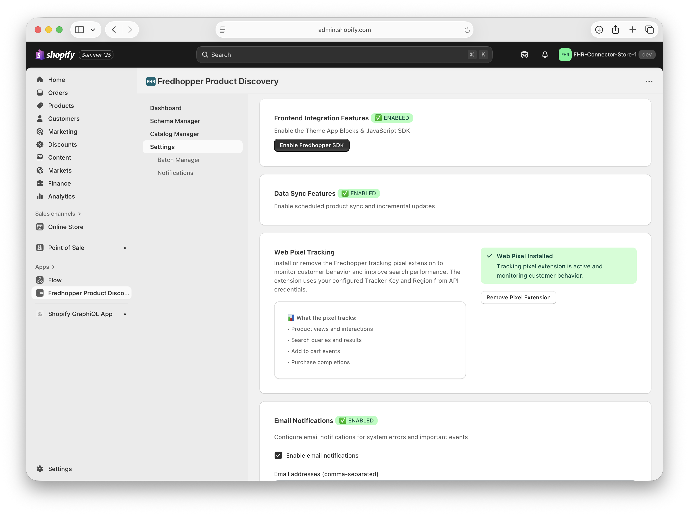
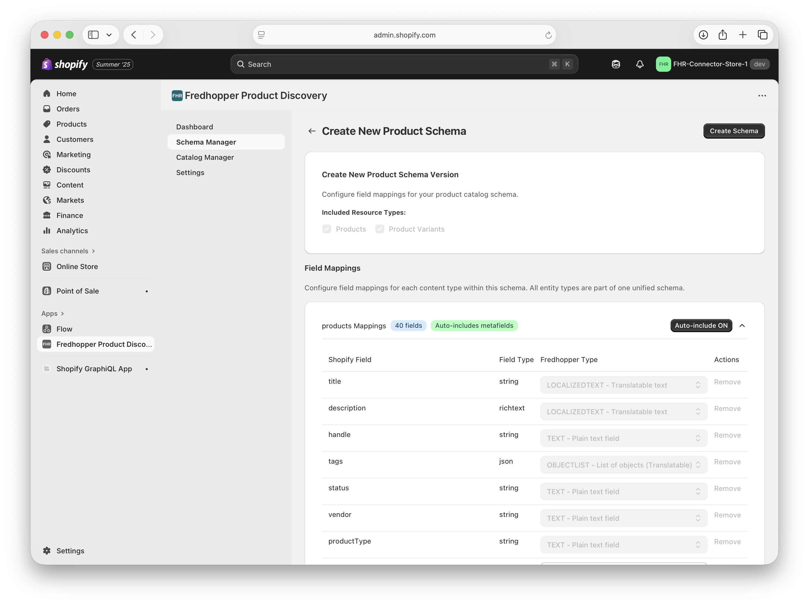
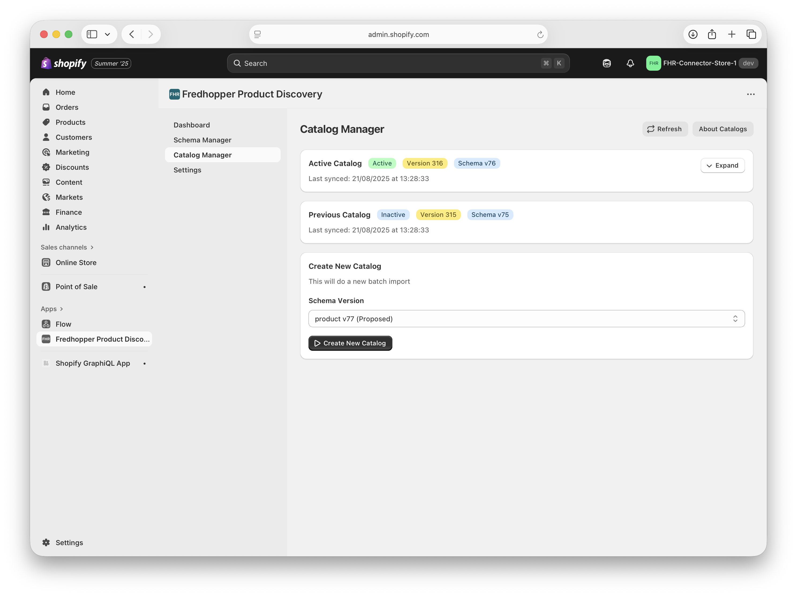

# User Guide

## Installing the app

To install the app inside your Shopify store, visit the App Store and type Fredhopper, or use the following URL: [Fredhopper Product Discovery](https://apps.shopify.com/fredhopper-product-discovery)

Click the install button and when prompted give the app the necessary permissions.

The app is now installed and is ready to be configured.

Contact to your CSM, Technical Consultant or onboarding team so they configure the app for you so it can communicate with your Fredhopper instance.

Once the app has been configured, you can start to use the features of the app.

### Installing the Web Pixel

The Fredhopper tracking pixel extension allows click data to be sent to Fredhopper’s tracker to power features such A/B testing, insights and AI scores.

To install the pixel, click the Install Pixel Extention button on the Settings page of the app.

For more information on the Pixel Extention, please view the [Web-Pixel Integration](../web-pixel/README.md)

You can remove the Web Pixel at anytime by clicking the Remove Pixel Extension button.

### Enabling the JavaScript SDK

The [JavaScript SDK](../sdk/README.md) allows developers to integrate Fredhopper into your front-end themes and blocks. The SDK adds an object to the window that you can use to make calls to the Fredhopper Query API via the Shopify App Proxy, adding the necessary filters to each call, and receiving the results to render on the page.

You can enable the SDK via the Settings page of the app by clicking on the Enable Fredhopper SDK button. Or by visiting theme editor within the Shopify Admin, selecting the App Embeds panel and toggling the Fredhopper SDK Loader.

For more information on using the SDK, please view the [SDK Documentation](../sdk/README.md)

## Using the Schema Manager

The Schema Manager allows you to create a schema that tells Fredhopper the shape and types of data that the app will be sending from Shopify to Fredhopper. This allows Fredhopper to have an understanding of the data and defines how it can be used in Fredhopper when creating facets, rankings and other rules.

The schema manager displays the data fields within Shopify and allows them to be mapped to types in Fredhopper. You can add, remove or adjust these.

In addition to the basic product fields, which are fixed within the app, the app also supports most metafield formats within Shopify. As well as syncing basic type metafields, the app processes and transforms the data linked to certain reference type metafields and metabojects, converting them into formats Fredhopper can use and making them usable for creating facets and result modifications in Fredhopper.

Shopify supports up to three variant option fields per product (e.g., size, color, material). These are text-based and unique to each product, even when option names overlap across products. To make option data usable in Fredhopper, the app creates dedicated fields in Fredhopper for every unique option across all of Shopify's variant data. This allows consistent filtering (using facets and result modifications) across all product variants that share the same option name regardless of how the data is stored. For Example, if any product variant has an option with the text *Size*, the app will create an option_size field in the Schema. When the product data is synced, any variant with an option named *Size* will have it's value (e.g. S, M, L, etc) asigned to this field in Fredhopper which could be then used to create a Size facet. Note that these fields are auto-generated during schema creation and updates. They do not appear in the Schema Manager and cannot be manually configured.

Once created, the schema will be saved to Fredhopper and used by the [Sync Manager](#using-the-sync-manager) to transform and send the data stored in Shopify into a format that Fredhopper understands as part of the catalog sync.

You can create new Schemas if the data structure has been changed in Shopify, for example a new metafield has been added, or you can use the edit button to use a previous schema version as a template for a new schema.

Once the schema has been created, you can use the [Sync Manager](#using-the-sync-manager) to run a full catalog sync using that schema or you can wait for the next [scheduled catalog sync](#setting-a-schedule) to happen.

If you have created a new metafield or variant option and it is not being displayed within the Schema Manager or in Fredhopper, start a bulk sync via the [Sync Manager](#using-the-sync-manager) with the **auto-activate** option turned off. This will sync the data ready for sending to Fredhopper but not activate the catalog inside Fredhopper. See the [Sync Manager](#using-the-sync-manager) section for more details. Once this process is complete, the new fields will show in the Schema Manager and you can create a new schema to tell Fredhopper to use these fields. Note that the data for these fields will not be synced until a new Schema is created and another data sync has been run.

> Metafields and metaobjects:
>
> Not all reference type metafields or metaobjects can be transformed due to their unknown structures. Certain reference type metafields are pre-processed where as others return the id of the object being referenced to. Where possoble, metaobjects are sent to Fredhopper as a collection of fields in JSON format. Although these may appear as raw data in Fredhopper, it can be useful for relayinng to the frontend for processing. Such fields can be excluded from a schema in Schema Manager if needed.
>
> The following metafield types are also automatically exclude:
> - Customer
> - Company
> - Collection
> - Page
> - MediaImage

## Using the Sync Manager

The Sync Manager is the central hub for managing product data synchronization between Shopify and Fredhopper. It consolidates catalog creation, bulk sync processing, streaming queue monitoring, and scheduling into a single page.

You can access the Sync Manager via the **Sync Manager** navigation item in the app sidebar.

### Starting a Bulk Sync

A bulk sync transfers all product data from Shopify to a new Fredhopper catalog. To start one:

1. Select the **Schema** to use. Only schemas that have been synced to Fredhopper are available. The latest version is selected by default.
2. Choose whether **auto-activate** should be enabled (it is on by default).
3. Click **Start Bulk Sync**.

<!-- TODO: Replace with new screenshot of Sync Manager -->

The app will then:

1. Create an **inactive catalog** in Fredhopper and sync the category tree.
2. **Populate** the processing queue with all active Shopify product IDs.
3. **Process** the queue: products are fetched from Shopify, transformed using the selected schema, and streamed to the inactive Fredhopper catalog.
4. Once all items are processed:
   * **Auto-activate on**: The catalog is automatically activated in Fredhopper. Any webhook updates that arrived during processing are caught up via the catch-up mechanism (see [Streaming Updates](#streaming-updates)).
   * **Auto-activate off**: The process pauses at the **Ready for Activation** status. You can then activate manually by clicking the **Activate** button.

You can toggle the auto-activate setting at any time during the process — even while syncing is already in progress.

### Bulk Sync Progress

The Sync Manager displays real-time progress through the following phases:

| Phase | Description |
|-------|-------------|
| **Populating** | Product IDs are being fetched from Shopify and written to the processing queue |
| **Processing** | Products are being transformed and streamed to the inactive Fredhopper catalog |
| **Ready for Activation** | All items processed, waiting for manual activation (only when auto-activate is off) |
| **Activating** | The activation request has been sent to Fredhopper; catch-up items are being flushed |
| **Catching Up** | Webhook updates received during processing are being replayed to the now-active catalog |
| **Completed** | Bulk sync finished successfully |

Additional statuses include **Failed**, **Cancelled**, and **Skipped** (when the scheduler skips a run because a process is already active).

You can **cancel** a running bulk sync or **retry** a failed one directly from the Sync Manager.

### Bulk Sync History

The Sync Manager shows a history of the last 20 bulk sync processes with their status, duration, item counts, and error information.

### Streaming Queue Chart

A real-time chart visualizes the throughput of the streaming queue during a bulk sync, showing pending, processing, completed, and failed item counts over time.

### Queue Correction

The **Queue Correction** tool (accessible via the page header) allows you to repair stuck or inconsistent queue items. This is useful in rare cases where items get stuck in a processing state.

### Preparing a Catalog Without Activating

If you want to prepare a full data sync without immediately activating the catalog in Fredhopper, start a bulk sync with **auto-activate turned off**. The process will complete all data processing and stop at the **Ready for Activation** status. You can then:

* Click **Activate** to activate the catalog when ready.
* Or start a new bulk sync to discard the prepared catalog.

This is useful for validating data before going live or timing a catalog activation for a specific moment.

### Manual Sync vs. Scheduled Sync

Starting a bulk sync from the Sync Manager is equivalent to a manual catalog sync. This is useful if you have made changes to the schema and/or data structure in Shopify and don't want to wait for the next [scheduled sync](#setting-a-schedule) before the changes are sent to Fredhopper.

Any non-structural changes to products, such as updating a product's title, will be automatically streamed to the current active catalog in Fredhopper via the [streaming queue](#streaming-updates) when the product is changed.

## Streaming Updates

The app automatically processes product changes throughout the day via a queue-based streaming mechanism:

1. When a product is **created**, **updated**, or **deleted** in Shopify, a webhook event is received by the app.
2. The event is written to the **product streaming queue** as a queue item.
3. A dispatcher (running every minute) checks for pending streaming items and triggers the streaming processor.
4. The processor fetches the product data from Shopify, transforms it using the active schema, and streams it to the **active** Fredhopper catalog.

This ensures that product changes made throughout the day are reflected in Fredhopper in near real-time without requiring a full catalog sync.

### Catch-Up Mechanism During Bulk Sync

When a bulk sync is in progress, webhook updates are handled with a dual-write strategy:

* The update is written to the **active catalog queue** for immediate processing (so the live storefront stays up-to-date).
* A second entry is written with a **pending catch-up** marker targeting the **inactive catalog** being built by the bulk sync.

When the bulk sync reaches the activation phase:

1. All pending catch-up items are **flushed** to the inactive catalog before activation.
2. The catalog is activated in Fredhopper.
3. Any additional catch-up items that arrived during activation are **replayed** to the now-active catalog.

This ensures that no product updates are lost during a bulk sync and the newly activated catalog is fully up-to-date.

### Feedback Dashboard

The **Feedback Dashboard** (accessible from the app sidebar) provides statistics and error tracking for streaming updates. You can view failed updates, retry counts, and overall streaming health.

## Setting a Schedule

The **Schedule Manager** (accessible via the Sync Manager page header) allows you to configure automated catalog syncs at times that suit your business.

<!-- TODO: Replace with new screenshot of Schedule Manager -->

### Schedule Configuration

The schedule supports the following options:

| Option | Description |
|--------|-------------|
| **Interval** | Run every X days or every X weeks |
| **Weekdays** | Select specific days of the week (Mon–Sun) when weekly interval is used |
| **Desired Activation Time** | The time when you want the catalog to be live in Fredhopper. The app uses smart timing to calculate the optimal start time based on historical processing durations. |
| **Latest Start Time** | A fallback start time in case the smart timing calculation cannot determine an optimal start |
| **Timezone** | Automatically detected from your browser, but can be adjusted |

### Smart Timing

When a **desired activation time** is configured, the scheduler calculates the optimal start time using a Fibonacci-weighted average of processing times from recent bulk syncs. This means the app learns from past performance to start the sync early enough so the catalog is ready at your desired time.

The Schedule Manager displays an **ETA** with a confidence level:

* **High** (4+ previous runs): Reliable estimate based on sufficient historical data
* **Medium** (2–3 previous runs): Reasonable estimate, may vary
* **Low** (<2 previous runs): Rough estimate, recommend monitoring the first few runs

### Safety Rules

| Rule | Default | Description |
|------|---------|-------------|
| **Skip if running** | On | Skips the scheduled sync if a bulk process is already active. A notification is sent with details. |
| **Failed items threshold** | 100 | Pauses scheduling if the most recent sync had more than this number of failed items |
| **Pause after failure** | 60 min | Duration to pause scheduling after the failure threshold is exceeded |
| **Auto-disable** | After 5 consecutive failures | The schedule is automatically disabled after repeated startup failures |

We recommend that you set up a nightly sync of all your product data, with streaming updates handling incremental changes throughout the day.

## Theme App Blocks

In additional to the [SDK](../sdk/README.md), the app also provides two basic Theme App Blocks with fixed layouts, one for collection pages and one for search, that can be used out-of-box within your shop's theme. These blocks use the SDK to retrieve data from the Fredhopper Query API and render the results, including facets, within a listing format.

For more information on using the SDK, please view the [SDK Documentation](../sdk/README.md)

