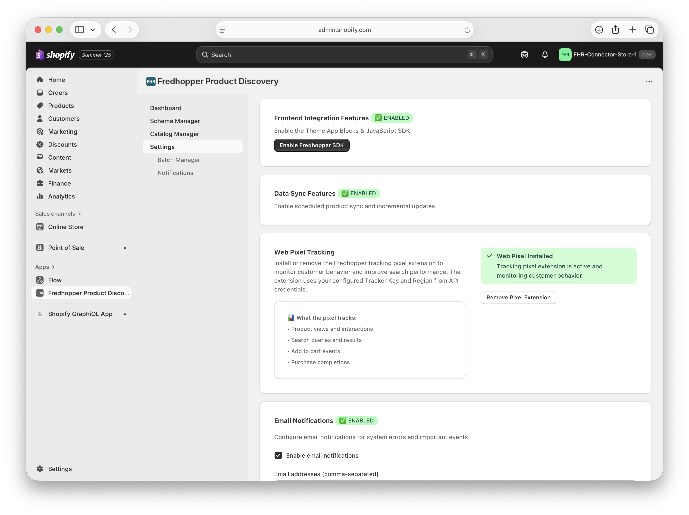
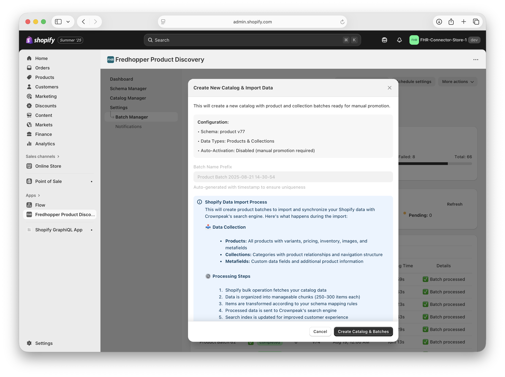
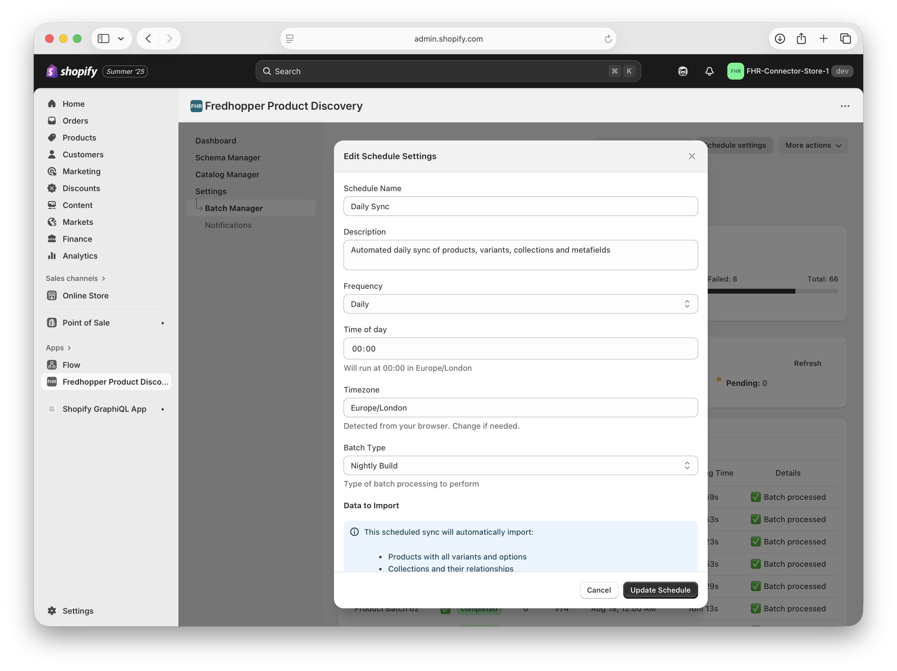

# User Guide

## Installing the app

To install the app inside your Shopify store, visit the App Store and type Fredhopper, or use the following URL: [Fredhopper Product Discovery](https://apps.shopify.com/fredhopper-product-discovery)

Click the install button and when prompted give the app the necessary permissions.

The app is now installed and is ready to be configured.

Contact to your CSM, Technical Consultant or onboarding team so they configure the app for you so it can communicate with your Fredhopper instance.

Once the app has been configured, you can start to use the features of the app.

### Installing the Web Pixel

The Fredhopper tracking pixel extension allows click data to be sent to Fredhopper’s tracker to power features such A/B testing, insights and AI scores.

To install the pixel, click the Install Pixel Extention button on the Settings page of the app.

You can remove the Web Pixel at anytime by clicking the Remove Pixel Extension button.

### Enabling the JavaScript SDK

The [JavaScript SDK](../sdk/README.md) allows developers to integrate Fredhopper into your front-end themes and blocks. The SDK adds an object to the window that you can use to make calls to the Fredhopper Query API via the Shopify App Proxy, adding the necessary filters to each call, and receiving the results to render on the page.

You can enable the SDK via the Settings page of the app by clicking on the Enable Fredhopper SDK button. Or by visiting theme editor within the Shopify Admin, selecting the App Embeds panel and toggling the Fredhopper SDK Loader.

For more information on using the SDK, please view the [SDK Documentation](../sdk/README.md)

## Using the Schema Manager

The Schema Manager allows you to create a schema that tells Fredhopper the shape and types of data that the app will be sending from Shopify to Fredhopper. This allows Fredhopper to have an understanding of the data and defines how it can be used in Fredhopper when creating facets, rankings and other rules.

The schema manager displays the data fields within Shopify and allows them to be mapped to types in Fredhopper. You can add, remove or adjust these.

In addition to the basic product fields, the app also supports most metafield formats within Shopify with the exception of reference type metafields. Any reference type metafields included in the schema will only send an object reference link to Fredhopper.

Once created, the schema will be saved to Fredhopper and used by the [Catalog Manager](#using-the-catalog-manager) and the [Batch Manager](#using-the-batch-manager) to transform and send the data stored in Shopify in to a format that Fredhopper understands as part of the catalog sync.

You can create new Schemas if the data structure has been changed in Shopify, for example a new metafield has been added, or you can use the edit button to use a previous schema version as a template for a new schema.

Once the schema has been created, you can use the [Catalog Manager](#using-the-catalog-manager) to run a full catalog sync using that schema or you can wait for the next [scheduled catalog sync](#setting-a-schedule) to happen.

If you have created a new metafield and it is not being displayed within the Schema Manager, please use the Create Staging Catalog option within the [Batch Manager](#using-the-batch-manager) to run a sync to ensure that the app has the latest set of data from Shopify. This will sync the data ready for sending to Fredhopper but not activate the catalog inside Fredhopper. See the [Batch Manager](#using-the-batch-manager) section for more details. Once this process is complete, the new fields will show in the Schema Manager and you can create a new schema to tell Fredhopper to use these fields.

## Using the Catalog Manager

The Catalog Manager shows you the details of the current active catalog in Fredhopper and allows you to create a new catalog and manually sync data to Fredhopper.

To sync all of the product data and create a new catalog in Fredhopper, you can first select the Schema to used, the latest version of the schema will be selected be default, and click the Create New Catalog button.

The will start the process of batching the data from Shopify, running the transformation and post processing jobs and send the data to Fredhopper.

Once the batch processing has completed, Fredhopper will be told to activate the catalog and will start to index all of the data for use within your frontend storefront.

Creating a manual catalog sync is useful if you have made changes to the schema and/or data structure in Shopify and don’t want to wait for the next [scheduled catalog sync](#setting-a-schedule) before the changes are sent to Fredhopper.

Any none structural changes to products, such as updating a product’s title, will be automatically sent to the current active catalog in Fredhopper when the product has been changed to ensure changes throughout the day are applied to Fredhopper.

## Using the Batch Manager

The Batch Manager allows you to view the progress of any running batch jobs and the status of previous jobs.

You can also create a staging catalog from within the Batch Manager.

When you create a staging catalog it will prepare a batch and process and transform the data from Shopify in the same way that the [Catalog Manager](#using-the-catalog-manager) does but it will not activate the data in Fredhopper until later activated via the Catalog Manager.

This is useful to ensure that the app has the latest set of data from Shopify or to prepare a data sync that you want to activate in Fredhopper at a certain point.

Once a staged batch is ready, you will see following displayed within the Catalog Manager.

You can click the Promote button to activate the catalog within Fredhopper, which will immediately start the activation and indexing process inside Fredhopper.

Alternately, you can abandon the staged catalog by selecting the new Create New Catalog radio button and clicking the Create New Catalog button

## Setting a Schedule

Using the [Batch Manger](#using-the-batch-manager), you can also set a scheduled to run a full catalog sync at a specific time that suits you.

This will perform a full catalog sync in the same way as the manual catalog sync works, but at a specific point in time.

We recommend that you do a nightly sync of all your product data, with incremental updates running throughout the day as products are updated.

## Theme App Blocks

In additional to the [SDK](../sdk/README.md), the app also provides two basic Theme App Blocks with fixed layouts, one for collection pages and one for search, that can be used out-of-box within your shop’s theme. These blocks use the SDK to retrieve data from the Fredhopper Query API and render the results, including facets, within a listing format.

For more information on using the SDK, please view the [SDK Documentation](../sdk/README.md)
